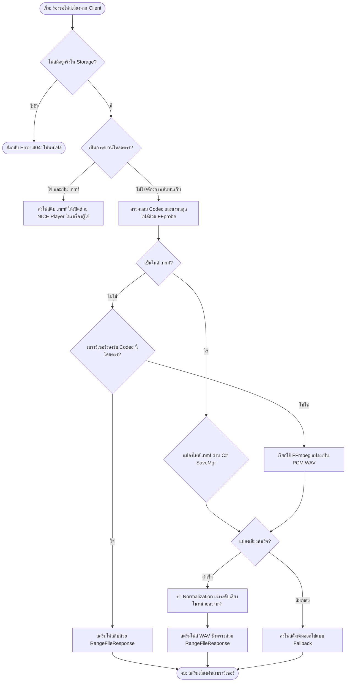
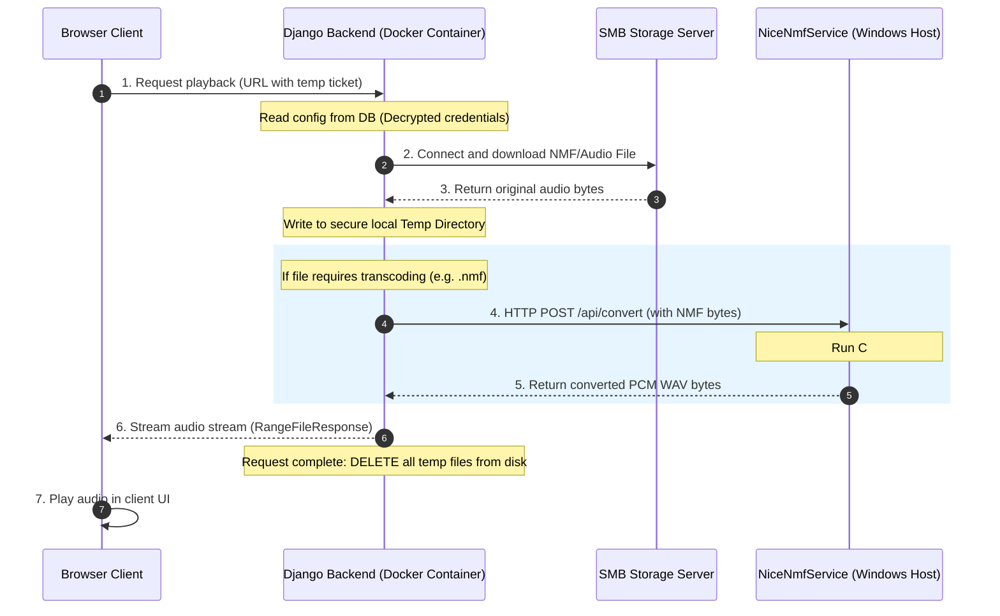

# คู่มือระบบเล่นและแปลงไฟล์เสียง (Audio Playback & Transcoding System Guide)

อัปเดตล่าสุด: 2026-07-03

เอกสารฉบับนี้อธิบายการทำงานและสถาปัตยกรรมของ **ระบบสตรีม เล่นเสียง และแปลงฟอร์แมตไฟล์เสียงทั้งหมด (Audio Playback & Transcoding System)** ภายในโปรเจคนี้ ซึ่งรองรับประเภทไฟล์เสียงที่หลากหลาย ตั้งแต่ไฟล์ปกติไปจนถึงไฟล์บันทึกโทรศัพท์รุ่นเก่าและไฟล์เข้ารหัสพิเศษ

---

## 🎵 1. การแบ่งประเภทไฟล์เสียงในระบบ (Audio File Categories)

ระบบหลังบ้านจะจำแนกและประมวลผลไฟล์เสียงออกเป็น **3 ประเภทหลัก** เพื่อส่งสัญญาณเสียงที่เหมาะสมที่สุดให้แก่เบราว์เซอร์:

### ประเภทที่ 1: ไฟล์ปกติทั่วไป (Browser-Compatible Files)
* **รูปแบบไฟล์**: `.wav` (PCM 16-bit), `.mp3`, `.ogg`, `.flac`, `.m4a`, `.aac`
* **กลไกการเล่น**: ระบบหลังบ้านจะสตรีมไฟล์ดิบนี้ตรงไปยังเว็บเบราว์เซอร์ทันทีโดย **ไม่มีการแปลงไฟล์ (No Transcoding)** ทำให้ประหยัดทรัพยากรของเครื่อง Server ได้สูงสุด

### ประเภทที่ 2: ไฟล์โทรศัพท์ทั่วไป (Telephony Files - แปลงด้วย FFmpeg)
* **รูปแบบไฟล์**: ไฟล์เสียงบันทึกโทรศัพท์ตระกูล G.711 เช่น `.wav` (A-Law, Mu-Law), `.gsm`, หรือไฟล์ Codec โทรศัพท์ทั่วไปที่เว็บเบราว์เซอร์ไม่รองรับโดยตรง
* **กลไกการเล่น**: หลังบ้าน Django จะตรวจพบว่า Codec ของไฟล์ไม่พร้อมเล่นบนเบราว์เซอร์ และจะเรียกใช้เครื่องมือ **FFmpeg** บนระบบปฏิบัติการเพื่อถอดรหัสและแปลงสัญญาณเสียงแบบ On-the-fly ให้กลายเป็น **WAV PCM 16-bit** ชั่วคราว ก่อนส่งออกไปเล่นที่หน้าเบราว์เซอร์

### ประเภทที่ 3: ไฟล์เสียงเข้ารหัสพิเศษ (Special NICE Files - แปลงด้วย .NET SaveMgr)
* **รูปแบบไฟล์**: ไฟล์ตระกูล **`.nmf` (Nice Media File)** ของระบบบันทึกเสียง NICE Systems
* **กลไกการเล่น**: เป็นฟอร์แมตแบบพิเศษที่มักจัดเก็บเสียงแยกเป็น 2 ฝั่ง (Agent และ Customer) และบางไฟล์ถูกเข้ารหัสลับ (Encrypted) 
* **ตัวแปลง**: ระบบจะใช้โปรแกรม **`NiceNmfConverter.exe` (C#)** จำลองการโหลด Playlist และสั่งออกไฟล์เสียงด้วยกลไก **.NET SaveMgr (WaveController)** ของเครื่อง Windows Host เพื่อกู้คืนและรวมเสียง (Merge) ของทั้งสองฝั่งออกมาเป็นไฟล์ WAV PCM 16-bit ที่สมบูรณ์ พร้อมรันตัวปรับเร่งเสียงอัตโนมัติ (Normalization) ให้ชัดเจนก่อนส่งกลับไปที่หน้าเว็บ

---

## 📊 2. ผังตรรกะการตัดสินใจของระบบหลังบ้าน (Playback Logic Flowchart)

แผนภาพแสดงขั้นตอนการวิเคราะห์ ตรวจสอบ และตัดสินใจแปลงไฟล์ของหลังบ้าน Django ก่อนทำการสตรีม:

---

## 🏗️ 3. สถาปัตยกรรมเครือข่ายและการดึงข้อมูลแบบปลอดภัย (Security & SMB Proxy)

ความปลอดภัยในการดึงไฟล์จากเครื่อง Server Storage (ผ่านโปรโตคอล SMB) ถูกออกแบบมาในรูปแบบ **Gateway Proxy** ซึ่งผู้ใช้งานฝั่ง Client (เบราว์เซอร์) จะ **ไม่มีทางรับรู้หรือเข้าถึงตำแหน่งและไฟล์เสียงจริงได้โดยตรง**:

### จุดเด่นเชิงความปลอดภัย (Security Highlights):
1. **Folder Obfuscation**: เบราว์เซอร์จะไม่เห็นที่อยู่แชร์จริง (เช่น `\\NICHETEL-DOMAIN\Users\...`) เห็นเพียง Endpoint ชั่วคราวของระบบหลัก
2. **Credential Privacy**: รหัสผ่าน SMB ถูกบันทึกไว้หลังบ้านเท่านั้น ไม่มีการรั่วไหลออกไปฝั่งเบราว์เซอร์
3. **No Storage Leak (ลบไฟล์อัตโนมัติ)**: ไฟล์เสียงทั้งหมดจะถูกดาวน์โหลดและแปลงเป็นไฟล์เสียงประเภทอื่นภายในพื้นที่จัดเก็บชั่วคราว (Temp Folder) ของเครื่อง Server เท่านั้น เมื่อเบราว์เซอร์ดาวน์โหลดและเล่นเสียงจนเสร็จสิ้น หลังบ้านจะทำการสั่งทำความสะอาดลบไฟล์ชั่วคราวนั้นออกจากฮาร์ดดิสก์ของ Server ทันที ป้องกันการแอบสกัดดึงข้อมูลไฟล์เสียงออกไป

---

## 💻 4. รายละเอียดการทำงานของฝั่ง Client (Vue.js AudioPlayer)

หน้าเว็บเบราว์เซอร์จะแสดงผลเครื่องมือเล่นเสียงผ่านคอมโพเนนต์ [AudioPlayer.vue](file:///C:/Users/ACER/Documents/GitHub/nt_playback/frontend/src/components/AudioPlayer.vue) ซึ่งมีกลไกที่น่าสนใจดังนี้:

### 1. เครื่องมือวาดคลื่นเสียง (Waveform Drawing via AudioContext)
* ระบบจะไม่ใช้รูปภาพจำลอง แต่จะนำไบนารี WAV ที่สตรีมเข้ามาทำการถอดรหัสในเบราว์เซอร์ผ่าน Web Audio API (`AudioContext.decodeAudioData`)
* นำข้อมูล Sample เสียงที่ได้มาคำนวณและวาดกราฟความถี่ (Peaks) ออกมาเป็นรูปคลื่นเสียงการสนทนาของ **Mono** หรือ **Stereo (แยกฝั่ง Agent บน / Customer ล่าง)** บน Canvas ได้อย่างแม่นยำและตอบสนองตามเวลาจริง

### 2. แถบโหลดทันที (Instant Loading Overlay)
* เมื่อผู้ใช้กดปุ่มเล่นเสียง หน้าต่างตัวเล่นเสียงจะเคลียร์ Waveform เก่าทิ้งทันที และแสดงแถบสีฟ้ากึ่งโปร่งใสทับพื้นที่กราฟ พร้อมกับสปินเนอร์หมุนและข้อความ **`Loading...`** เพื่อให้ผลลัพธ์ตอบสนองที่รวดเร็วแก่ผู้ใช้ ระหว่างที่รอหลังบ้านดึงไฟล์จาก SMB และรันตัวแปลงเสียง
* แถบโหลดจะหายไปทันทีเมื่อหลังบ้านส่งไฟล์เสียง WAV เข้ามาถอดรหัสและพร้อมเล่นเสียง

### 3. ระบบรองรับ HTTP Range (Partial Content - Seeking)
* หน้าตัวเล่นเสียงรองรับการกดเลื่อนเวลาเพื่อฟังเฉพาะส่วน (Seek Track) 
* ฝั่งหลังบ้านรองรับการส่งคำขอช่วงข้อมูล (`Range: bytes=start-end`) ทำให้เบราว์เซอร์ดาวน์โหลดเฉพาะบางช่วงวินาทีที่ผู้ใช้คลิกเลื่อนไปฟังได้ทันที ช่วยลดการใช้งานแบนด์วิธเครือข่าย
