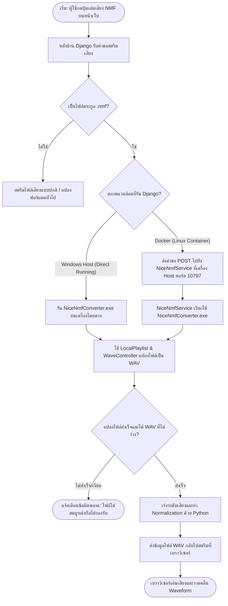
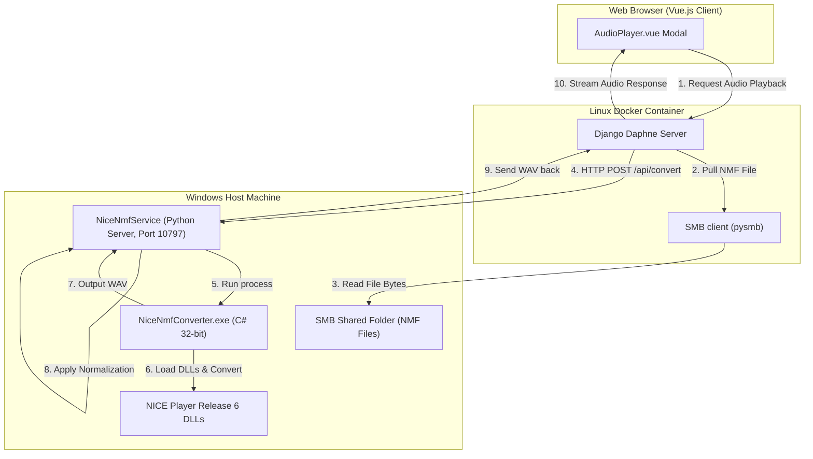
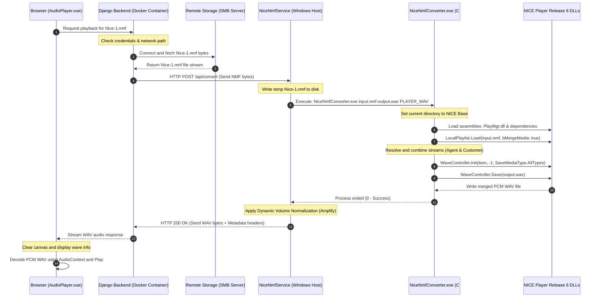

# NICE NMF Integration Guide (.NET SaveMgr Mode)

อัปเดตล่าสุด: 2026-07-03

เอกสารฉบับนี้อธิบายรายละเอียดเกี่ยวกับระบบสตรีมและเล่นไฟล์เสียง NICE `.nmf` (NMF Web Playback) ผ่านเว็บเบราว์เซอร์ โดยใช้เทคโนโลยี **.NET SaveMgr (WaveController)** ของ NICE Player Release 6 เพื่อดึงและถอดรหัสสัญญาณเสียงให้มีความถูกต้องสูงสุด (เทียบเท่ากับการกด Save WAV บนโปรแกรมเล่นเสียง NICE Player โดยตรง)

---

## 📊 ผังแสดงตรรกะการทำงาน (Program Logic Flowchart)

นี่คือผังการทำงานหลัก (Flowchart) ของระบบเล่นเสียง NMF ที่แสดงการตัดสินใจในแต่ละเงื่อนไข (ตามรูปแบบมาตรฐานที่คุณแนะนำ):



---

## 🏗️ สถาปัตยกรรมระบบ (System Architecture)

เนื่องจากไลบรารีของ NICE Player เป็น **Windows Native (32-bit)** แต่ระบบหลังบ้านหลักของโปรเจครันอยู่ใน **Linux Docker Container** เราจึงแยกส่วนการถอดรหัสออกมาเป็น **Microservice (NiceNmfService)** รันอยู่เบื้องหลังบน Windows Host



---

## 🔒 ความปลอดภัยของระบบและการจัดเก็บไฟล์เสียง (Security & SMB Privacy)

ระบบจัดเก็บและถอดรหัสไฟล์เสียงนี้มีลักษณะการออกแบบเชิงความปลอดภัยแบบ **Backend-Proxy Gate** ซึ่งเป็นแนวทางมาตรฐานความปลอดภัยระดับสูง มีจุดเด่นดังนี้:

### 1. การซ่อนโฟลเดอร์ต้นทาง (Folder Obfuscation)
* **ผู้ใช้ฝั่ง Client จะมองไม่เห็นโฟลเดอร์ต้นทาง 100%**: ผู้ใช้ปลายทางที่ใช้งานเบราว์เซอร์จะไม่ทราบเลยว่าไฟล์เสียงจริงถูกเก็บไว้ที่ Network Path ใด (เช่น `\\NICHETEL-DOMAIN\Users\...`) หรือเก็บไว้ในเครื่อง Server ใด
* **การจำกัดสิทธิ์การเข้าถึง**: สิทธิ์การเข้าถึงโฟลเดอร์เก็บไฟล์เสียง (SMB Share) จะถูกจำกัดไว้ให้เฉพาะเครื่องหลังบ้าน Django เท่านั้น เครื่องผู้ใช้ภายนอกไม่มีสิทธิ์เข้าถึงหรือ Map Network Drive ดังกล่าวได้โดยตรง

### 2. การรักษาความลับของสิทธิ์เข้าถึง (Credential Masking)
* บัญชีผู้ใช้งานและรหัสผ่าน (Username / Password) ที่ใช้เชื่อมต่อ SMB จะถูกเก็บเป็นความลับที่ **ฝั่ง Server เท่านั้น** (อยู่ในฐานข้อมูลหลังบ้านหรือเก็บแบบเข้ารหัส) และจะไม่มีการส่งข้อมูลรหัสผ่านนี้ออกไปฝั่ง Client อย่างเด็ดขาด

### 3. วงจรชีวิตของไฟล์ชั่วคราว (Temporary File Lifecycle)
* **การทำงาน**: เมื่อผู้ใช้กดปุ่มเล่นเสียง หลังบ้าน Django จะต่อเข้าไปดึงไฟล์ผ่าน SMB นำมาเขียนลงโฟลเดอร์ Temp บนฝั่ง Server จากนั้นส่งไฟล์ Temp นี้ไปที่ API เพื่อทำการแปลงเป็น WAV 
* **การลบไฟล์ทันทีหลังส่งออก**: หลังจากส่งข้อมูลไบนารีเสียง WAV กลับไปยังหน้าเบราว์เซอร์จนจบคำขอแล้ว ตัวระบบ Django (ผ่านคลาส `RangeFileResponse.close()`) จะสั่ง **ลบไฟล์ Temp นั้นออกจากเครื่อง Server ทันที** ทำให้ไม่มีไฟล์ตกค้างสะสมอยู่ในระบบ จึงปลอดภัยจากการถูกดึงไฟล์ข้อมูลออกไปในภายหลัง

---

## 🔄 ลำดับขั้นตอนการเล่นไฟล์เสียง (Sequence Diagram)

แผนภาพแสดงขั้นตอนตั้งแต่การกดปุ่มเล่นเสียงบนหน้าเว็บเบราว์เซอร์ ไปจนถึงการสตรีมและเล่นคลื่นเสียงกลับมายังผู้ใช้:



---

## 🛠️ จุดเด่นและการเพิ่มประสิทธิภาพ (Optimizations)

### 1. การเปลี่ยนผ่านจาก A-Law สู่ .NET SaveMgr (WaveController)
* **ปัญหาเดิม**: การใช้ฟังก์ชันแปลงไฟล์ปกติ (`NmfToVox` แปลงเป็น `PCM_A_LAW`) จะถอดรหัสเฉพาะ Audio Stream หลัก (มักเป็นช่องของ Agent อย่างเดียว หรือไม่ก็เงียบสนิทในไฟล์ที่มีการเข้ารหัส)
* **การแก้ไขด้วย SaveMgr**: ระบบจะจำลองการโหลด Playlist และใช้ `WaveController` สั่งออกข้อมูลเป็นไฟล์เสียง WAV ซึ่งจะได้เนื้อเสียงครบถ้วนจากทุกช่องสัญญาณ (ทั้งฝั่ง Agent และ Customer) และรองรับการถอดรหัสไฟล์บันทึกเสียงที่มีความปลอดภัยสูงได้ทั้งหมด

### 2. ขจัดความล่าช้าด้วย Native C# (ลดจาก 6 วินาที เหลือต่ำกว่า 0.5 วินาที)
* **ปัญหาเดิม (PowerShell Bridge)**: การใช้สคริปต์ PowerShell (`.ps1`) เพื่อคอมไพล์ C# บนหน่วยความจำในอดีต ทำให้เสียเวลาเปิดโปรเซส PowerShell สูงถึง 5 - 7 วินาทีต่อการเล่นเสียงหนึ่งครั้ง และมักมีปัญหา **`StackOverflowException`** จาก Assembly Resolver ภายใน Windows
* **การแก้ไข**: เราพัฒนาโปรแกรม [NiceNmfConverter.exe](file:///C:/Users/ACER/Documents/GitHub/nt_playback/NiceNmfService/tools/NiceNmfConverter.exe) ขึ้นด้วยภาษา C# และคอมไพล์เป็นโปรแกรมทำงานแบบ 32-bit โดยตรง ทำให้เปิดทำงานได้อย่างทันที ปลอดภัยจากปัญหาหน่วยความจำล้น และถอดรหัสไฟล์เสร็จสิ้นภายในไม่กี่มิลลิวินาที

### 3. ระบบเร่งระดับเสียงอัจฉริยะ (Dynamic Volume Normalization)
เนื่องจากไฟล์เสียงสนทนาที่ถูกบีบอัดมักมีระดับเสียงที่เบากว่าปกติ หลังจากการแปลงไฟล์ด้วย C# เสร็จสิ้น ระบบหลังบ้าน Python จะทำการ:
* ตรวจสอบหาค่าความดังสูงสุด (Peak Amplitude) ของเสียง
* คำนวณและปรับเร่งเสียงเพิ่มโดยอัตโนมัติ (ขยายระดับเสียงขึ้นสูงสุดได้ถึง 6 เท่า) ให้ได้ความดังมาตรฐานที่ 85% ของคลื่นเสียงทั้งหมด (`Peak = 28000`)
* มีกลไกป้องกันเสียงแตก (Clipping Protection) และป้องกันการเร่งเสียงรบกวนในไฟล์เงียบสนิท (Noise Gate Protection)

---

## 🌐 รายละเอียด API บริการ (API Reference)

ตัวบริการรันด้วย Python `ThreadingHTTPServer` ที่พอร์ต **`10797`**

### 1. ตรวจสอบสถานะการเชื่อมต่อ (Health Check)
ใช้เพื่อเช็คความพร้อมการโหลดไลบรารีและเวอร์ชันของ NICE DLL
* **Endpoint**: `GET http://127.0.0.1:10797/api/health`
* **Response (JSON)**:
  ```json
  {
    "ok": true,
    "niceBase": "C:\\Program Files (x86)\\NICE Systems\\NICE Player Release 6",
    "powershell32": "C:\\Windows\\SysWOW64\\WindowsPowerShell\\v1.0\\powershell.exe",
    "dotnetConverter": "C:\\Users\\ACER\\Documents\\GitHub\\nt_playback\\NiceNmfService\\tools\\NiceNmfConverter.exe",
    "dotnetReady": true,
    "supportedEngines": ["dotnet", "powershell"],
    "requiredFiles": [
      { "name": "ERS.Common.dll", "exists": true },
      { "name": "NiceApplications.Playback.Utils.dll", "exists": true },
      { "name": "NiceApplications.Playback.PlayMgr.dll", "exists": true }
      // ... รายชื่อ DLL ตัวอื่นๆ
    ],
    "missing": []
  }
  ```

### 2. แปลงไฟล์เสียง (Convert File)
ส่งข้อมูล NMF ไบนารีเพื่อรับไฟล์เสียง WAV
* **Endpoint**: `POST http://127.0.0.1:10797/api/convert?name=recording.nmf&engine=dotnet`
* **Request Header**: `Content-Type: application/octet-stream`
* **Response Body**: ข้อมูลไบนารีไฟล์เสียงมาตรฐาน `audio/wav`
* **Response Headers (Metadata)**:
  * `X-NMF-duration`: ความยาวเสียงจริง (วินาที)
  * `X-NMF-sample-rate`: อัตราสุ่มสัญญาณ (เช่น 8000 Hz)
  * `X-NMF-convert-ms`: ระยะเวลาที่ใช้ในการแปลงไฟล์ (มิลลิวินาที)
  * `X-NMF-server-ms`: ระยะเวลารวมทั้งหมดของคำขอแปลงไฟล์
