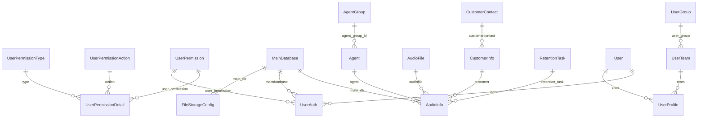

# เอกสารโครงสร้างตารางข้อมูล (Database Models Documentation)

เอกสารนี้รวบรวมและสรุปข้อมูลตารางทั้งหมดในฐานข้อมูลที่ถูกนิยามในไฟล์ `models.py` ของแต่ละ Django Application ในระบบ **nt_playback**

---

## 📊 แผนภาพความสัมพันธ์ (Entity-Relationship Diagram)

ด้านล่างนี้คือแผนภาพ ER Diagram แสดงความสัมพันธ์ (Relationships) ของแต่ละ Model ที่สำคัญในระบบ:

---

## 📂 รายชื่อตารางข้อมูลแยกตาม App

### 1. Configuration App (`configuration`)
จัดการสิทธิ์และการตั้งค่าสิทธิ์ของผู้ใช้งานในระบบ
ไฟล์ต้นฉบับ: [models.py](file:///c:/Users/ACER/Documents/GitHub/nt_playback/backend/apps/configuration/models.py)

#### 🔹 `UserPermissionType` (ชื่อตาราง: `tb_user_permission_type`)
ใช้เก็บประเภทของสิทธิ์การใช้งาน
* **name**: `CharField(255)` (Unique) - ชื่อประเภทสิทธิ์ (Type Name)

#### 🔹 `UserPermissionAction` (ชื่อตาราง: `tb_user_permission_action`)
ใช้เก็บ Action ของสิทธิ์ (เช่น Read, Write, Delete)
* **name**: `CharField(255)` (Unique) - ชื่อของ Action (Action Name)

#### 🔹 `UserPermission` (ชื่อตาราง: `tb_user_permission`)
ตารางหลักที่จัดกลุ่มการตั้งค่าสิทธิ์
* **type**: `CharField(255)` - ประเภท
* **name**: `CharField(255)` - ชื่อกลุ่มสิทธิ์
* **create_date**: `DateTimeField` (Auto Add) - วันเวลาที่สร้าง
* **update_date**: `DateTimeField` (Auto Update) - วันเวลาที่แก้ไขล่าสุด

#### 🔹 `UserPermissionDetail` (ชื่อตาราง: `tb_user_permission_detail`)
รายละเอียดการกำหนดสิทธิ์ย่อย เชื่อมโยงกลุ่มสิทธิ์, Action และประเภทสิทธิ์เข้าด้วยกัน
* **user_permission**: `ForeignKey` เชื่อมไปยัง `UserPermission` (CASCADE)
* **action**: `ForeignKey` เชื่อมไปยัง `UserPermissionAction` (CASCADE)
* **status**: `BooleanField` - สถานะการอนุญาต (เปิด/ปิด)
* **type**: `ForeignKey` เชื่อมไปยัง `UserPermissionType` (CASCADE)
* **default**: `BooleanField` - ค่าเริ่มต้นของสิทธิ์

---

### 2. Audio Core App (`core.model.audio`)
จัดการข้อมูลไฟล์เสียงและการโทรศัพท์
ไฟล์ต้นฉบับ: [models.py](file:///c:/Users/ACER/Documents/GitHub/nt_playback/backend/apps/core/model/audio/models.py)

#### 🔹 `AudioFile` (ชื่อตาราง: `tb_audiofile`)
เก็บรายละเอียดไฟล์เสียงจริง
* **file_path**: `CharField(512)` - พาธของไฟล์เสียง
* **file_name**: `CharField(255)` - ชื่อไฟล์
* **file_type**: `CharField(20)` (Blankable) - ประเภทของไฟล์ (เช่น mp3, wav)
* **file_size**: `IntegerField` (Default: 0) - ขนาดไฟล์ (Bytes)
* **duration**: `DurationField` (Nullable) - ความยาวของคลิปเสียง
* **created_at**: `DateTimeField` (Auto Add) - วันที่สร้างไฟล์ในระบบ

#### 🔹 `AudioInfo` (ชื่อตาราง: `tb_audioinfo`)
เก็บข้อมูล Metadata และการเชื่อมโยงของสายการโทรแต่ละสาย
* **main_db**: `ForeignKey` เชื่อมไปยัง `MainDatabase` (CASCADE, db_column: `maindatabase_id`)
* **customer**: `ForeignKey` เชื่อมไปยัง `CustomerInfo` (SET_NULL, Nullable)
* **audiofile**: `ForeignKey` เชื่อมไปยัง `AudioFile` (SET_NULL, Nullable)
* **agent**: `ForeignKey` เชื่อมไปยัง `Agent` (SET_NULL, Nullable)
* **call_direction**: `CharField(20)` - ทิศทางการโทร (Inbound / Outbound)
* **extension**: `CharField(20)` - เบอร์ภายใน (Extension)
* **customer_number**: `CharField(20)` - เบอร์โทรศัพท์ลูกค้า
* **start_datetime**: `DateTimeField` (Auto Add) - วันเวลาที่เริ่มโทร
* **end_datetime**: `DateTimeField` (Auto Update) - วันเวลาที่สิ้นสุดการโทร
* **note**: `TextField` (Nullable) - บันทึกย่อ
* **custom_field_1**: `CharField(255)` (Nullable) - ข้อมูลเพิ่มเติมที่ 1
* **status**: `BooleanField` (Default: True) - สถานะของ Record
* **retention_date**: `DateTimeField` (Nullable) - วันที่ต้องล้างข้อมูล (Retention Date)
* **retention_task**: `ForeignKey` เชื่อมไปยัง `RetentionTask` (SET_NULL, Nullable)
* **delete_option**: `CharField(50)` (Nullable) - ตัวเลือกการลบ

> [!NOTE]
> ตาราง `tb_audioinfo` มีการสร้าง Database Index ในฟิลด์ `(agent_id, start_datetime)` เพื่อช่วยให้การสืบค้นข้อมูลตาม Agent และเวลาทำได้รวดเร็วขึ้น

---

### 3. Authorize Core App (`core.model.authorize`)
จัดการสิทธิ์ผู้ใช้, ข้อมูลเจ้าหน้าที่ (Agent), กลุ่ม, และ Log การใช้งานระบบ
ไฟล์ต้นฉบับ: [models.py](file:///c:/Users/ACER/Documents/GitHub/nt_playback/backend/apps/core/model/authorize/models.py)

#### 🔹 `MainDatabase` (ชื่อตาราง: `tb_maindatabase`)
ข้อมูลการเชื่อมต่อฐานข้อมูลหลักของลูกค้า
* **database_name**: `CharField(255)` (Unique) - ชื่อฐานข้อมูล
* **description**: `TextField` - รายละเอียดฐานข้อมูล
* **status**: `BooleanField` (Default: True) - สถานะใช้งาน

#### 🔹 `UserAuth` (ชื่อตาราง: `tb_userauth`)
กำหนดสิทธิ์การเข้าถึงฐานข้อมูลของ User
* **user**: `ForeignKey` เชื่อมไปยัง `User` (Django Built-in) (CASCADE)
* **maindatabase**: `ForeignKey` เชื่อมไปยัง `MainDatabase` (CASCADE)
* **allow**: `BooleanField` (Nullable) - การอนุญาตสิทธิ์เข้าถึง
* **user_permission**: `ForeignKey` เชื่อมไปยัง `UserPermission` (SET_NULL, Nullable, db_column: `user_permisson_id`)

#### 🔹 `UserLog` (ชื่อตาราง: `tb_userlog`)
เก็บประวัติการทำงานของ User ในระบบ (Audit Trail)
* **user**: `ForeignKey` เชื่อมไปยัง `User` (SET_NULL, Nullable)
* **action**: `CharField(255)` - กิจกรรมที่ทำ (Action)
* **timestamp**: `DateTimeField` (Auto Add) - วันเวลาที่เกิดกิจกรรม
* **detail**: `TextField` - รายละเอียดกิจกรรม
* **ip_address**: `GenericIPAddressField` (Nullable) - ที่อยู่ IP ของผู้ใช้งาน
* **client_type**: `CharField(255)` (Nullable) - ข้อมูลบราวเซอร์/อุปกรณ์ (User Agent)
* **status**: `CharField(50)` (Nullable) - สถานะผลลัพธ์ (เช่น Success, Failure)

#### 🔹 `SetAudio` (ชื่อตาราง: `tb_set_audio`)
เก็บค่าพารามิเตอร์การตั้งค่าเสียงของผู้ใช้แต่ละคน
* **user**: `ForeignKey` เชื่อมไปยัง `User` (CASCADE)
* **audio_path**: `CharField(255)` - พาธเสียงที่ตั้งค่า
* **client_token**: `CharField(255)` (Nullable) - Token ของอุปกรณ์ผู้ใช้
* **selected**: `BooleanField` (Nullable) - สถานะการเลือกใช้งาน
* **create_at / update_at**: `DateTimeField`

#### 🔹 `Department` (ชื่อตาราง: `tb_department`)
เก็บข้อมูลแผนกหรือฝ่าย
* **name_th**: `CharField(255)` - ชื่อแผนกภาษาไทย
* **name_en**: `CharField(255)` - ชื่อแผนกภาษาอังกฤษ

#### 🔹 `AgentGroup` (ชื่อตาราง: `tb_agent_group`)
กลุ่มของเจ้าหน้าที่ (Agent Groups)
* **group_name**: `CharField(255)` - ชื่อกลุ่มเจ้าหน้าที่
* **description**: `TextField` - รายละเอียดกลุ่ม
* **status**: `IntegerField` - สถานะกลุ่ม

#### 🔹 `Agent` (ชื่อตาราง: `tb_agent`)
ข้อมูลพนักงาน/เจ้าหน้าที่รับสาย (Agent)
* **agent_code**: `CharField(50)` (Unique) - รหัสพนักงาน (Agent ID)
* **first_name**: `CharField(50)` - ชื่อจริง
* **last_name**: `CharField(50)` - นามสกุล
* **agent_group_id**: `ForeignKey` เชื่อมไปยัง `AgentGroup` (SET_NULL, Nullable, db_column: `agent_group_id`)
* **note**: `TextField` - หมายเหตุ

#### 🔹 `UserGroup` (ชื่อตาราง: `tb_user_group`)
กลุ่มของผู้ใช้ระบบ (User Groups)
* **group_name**: `CharField(255)` - ชื่อกลุ่มผู้ใช้
* **description**: `TextField` - รายละเอียดกลุ่ม
* **status**: `IntegerField` - สถานะกลุ่ม
* **create_at / update_at**: `DateTimeField`

#### 🔹 `UserTeam` (ชื่อตาราง: `tb_user_team`)
ทีมย่อยของผู้ใช้ เชื่อมต่อกับ UserGroup และสิทธิ์เข้าถึงฐานข้อมูลหลัก
* **name**: `CharField(255)` - ชื่อทีม
* **user_group**: `ForeignKey` เชื่อมไปยัง `UserGroup` (CASCADE, db_column: `user_group_id`)
* **maindatabase**: `TextField` (db_column: `maindatabase_id`) - รายการ Database ID ที่ผูกกับทีม
* **status**: `IntegerField` (Default: 1) - สถานะ
* **create_at / update_at**: `DateTimeField`

#### 🔹 `UserProfile` (ชื่อตาราง: `tb_userprofile`)
ข้อมูลโปรไฟล์เพิ่มเติมของ User (Extension of Django's built-in User)
* **user**: `ForeignKey` เชื่อมไปยัง `User` (CASCADE)
* **team**: `ForeignKey` เชื่อมไปยัง `UserTeam` (CASCADE, db_column: `team_id`)
* **user_code**: `CharField(255)` - รหัสพนักงานของผู้ใช้
* **phone**: `CharField(255)` (Nullable) - เบอร์โทรศัพท์
* **reset_password**: `IntegerField` (Default: 0) - สถานะการรีเซ็ตรหัสผ่าน
* **create_by**: `ForeignKey` เชื่อมไปยัง `User` (SET_NULL, Nullable, db_column: `create_by`) - ผู้สร้างโปรไฟล์นี้
* **session_token**: `CharField(255)` (Nullable) - Token สำหรับ Session ปัจจุบัน
* **privilege_history**: `BooleanField` (Nullable) - สิทธิ์ในการดูประวัติผู้ใช้งานอื่น
* **ad_account**: `BooleanField` (Default: False) - ล็อกอินผ่าน Active Directory หรือไม่
* **create_at / update_at**: `DateTimeField`

#### 🔹 `UserFileShare` (ชื่อตาราง: `tb_file_share`)
เก็บข้อมูลการแชร์ไฟล์เสียงให้กับบุคคลภายนอกทางอีเมล
* **user**: `ForeignKey` เชื่อมไปยัง `User` (CASCADE, db_column: `user_id`)
* **type**: `CharField(255)` - ประเภทการแชร์
* **code**: `CharField(255)` - รหัสความปลอดภัยในการเข้าถึง
* **email**: `TextField` - อีเมลที่ได้รับสิทธิ์แชร์
* **audiofile_id**: `TextField` - รายการไฟล์เสียงที่แชร์
* **limit_access_time**: `IntegerField` (Nullable) - จำกัดจำนวนครั้งในการเข้าถึง
* **access_time**: `IntegerField` (Nullable) - จำนวนครั้งที่เข้าถึงไปแล้ว
* **description**: `TextField` (Nullable) - รายละเอียด/เหตุผลในการแชร์
* **start_at**: `DateTimeField` - วันเวลาเริ่มต้นแชร์
* **expire_at**: `DateTimeField` - วันเวลาที่ลิงก์แชร์หมดอายุ
* **status**: `BooleanField` (Default: True) - สถานะการใช้งานของลิงก์แชร์
* **view**: `BooleanField` (Default: False) - สิทธิ์ในการรับฟัง (View)
* **dowload**: `BooleanField` (Default: False) - สิทธิ์ในการดาวน์โหลดไฟล์ (Download)
* **create_by**: `ForeignKey` เชื่อมไปยัง `User` (SET_NULL, Nullable, db_column: `create_by`)
* **create_at / update_at**: `DateTimeField`

#### 🔹 `IPBlacklist` (ชื่อตาราง: `tb_ip_blacklist`)
เก็บรายการ IP Address ที่ถูกบล็อกไม่ให้เข้าใช้งานระบบ
* **ip_address**: `GenericIPAddressField` (Unique) - ไอพีแอดเดรสที่ถูกบล็อก
* **reason**: `TextField` - เหตุผลที่บล็อก
* **created_at**: `DateTimeField` (Auto Add) - วันเวลาที่บล็อก
* **created_by**: `ForeignKey` เชื่อมไปยัง `User` (SET_NULL, Nullable) - ผู้ดำเนินการบล็อก

---

### 4. Customer Core App (`core.model.customer`)
จัดการข้อมูลลูกค้าผู้ติดต่อ
ไฟล์ต้นฉบับ: [models.py](file:///c:/Users/ACER/Documents/GitHub/nt_playback/backend/apps/core/model/customer/models.py)

#### 🔹 `CustomerContact` (ชื่อตาราง: `tb_customercontact`)
ข้อมูลสำหรับติดต่อลูกค้า
* **phone_number**: `CharField(20)` - เบอร์โทรศัพท์ลูกค้า
* **email**: `EmailField` - อีเมล
* **address**: `TextField` - ที่อยู่

#### 🔹 `CustomerInfo` (ชื่อตาราง: `tb_customerinfo`)
ข้อมูลส่วนตัวของลูกค้า
* **name**: `CharField(255)` - ชื่อลูกค้า
* **customercontact**: `ForeignKey` เชื่อมไปยัง `CustomerContact` (SET_NULL, Nullable)
* **company**: `CharField(255)` - บริษัท/หน่วยงาน
* **note**: `TextField` - บันทึกรายละเอียดเพิ่มเติม

---

### 5. Licenses Core App (`core.model.licenses`)
จัดการสิทธิ์และแพ็กเกจสิทธิ์การใช้งาน
ไฟล์ต้นฉบับ: [models.py](file:///c:/Users/ACER/Documents/GitHub/nt_playback/backend/apps/core/model/licenses/models.py)

#### 🔹 `License` (ชื่อตาราง: `tb_license`)
ข้อมูลแพ็กเกจ License ของลูกค้า
* **name**: `CharField(255)` - ชื่อแพ็กเกจ/ประเภท License
* **duration_years**: `IntegerField` (Default: 1) - อายุการใช้งาน (จำนวนปี)
* **features**: `JSONField` (Default: `{}`) - รายละเอียดสิทธิ์การเข้าถึงเมนูต่างๆ เช่น `{"menu1": true, "menu2": false}`
* **create_at / update_at**: `DateTimeField`

---

### 6. Home App (`home`)
จัดการข้อมูลส่วนตัวหน้าแรก, การตั้งค่าการค้นหา และการเข้าถึงไฟล์
ไฟล์ต้นฉบับ: [models.py](file:///c:/Users/ACER/Documents/GitHub/nt_playback/backend/apps/home/models.py)

#### 🔹 `FavoriteSearch` (ชื่อตาราง: `tb_favorite_search`)
บันทึกการตั้งค่าการค้นหาฟิลเตอร์โปรดของผู้ใช้
* **user**: `ForeignKey` เชื่อมไปยัง `User` (CASCADE)
* **favorite_name**: `CharField(30)` - ชื่อเงื่อนไขการค้นหาที่โปรดปราน
* **description**: `CharField(100)` - รายละเอียด/คำอธิบายเพิ่มเติม
* **raw_data**: `JSONField` - โครงสร้างฟิลเตอร์ค้นหาในรูปแบบ JSON
* **create_at / update_at**: `DateTimeField`

#### 🔹 `ViewAudio` (ชื่อตาราง: `view_audio`)
เก็บรายละเอียดประวัติการเปิดฟังหรือความเกี่ยวข้องของสายสนทนา
* **interaction_id**: `IntegerField` - ID ของการสนทนา
* **database_name**: `TextField` - ชื่อฐานข้อมูลต้นทาง
* **file_path**: `TextField` - พาธไฟล์เสียง
* **duration_seconds**: `IntegerField` - ความยาวไฟล์ (วินาที)
* **call_direction**: `IntegerField` - ทิศทางการโทร
* **phone_number**: `IntegerField` - เบอร์โทรศัพท์ที่ใช้สนทนา
* **extension**: `TextField` - เบอร์ภายใน
* **legacy_agent_id**: `TextField` - รหัส Agent เดิม
* **agent_name**: `TextField` - ชื่อ Agent
* **agent_group**: `TextField` - กลุ่ม Agent
* **first_name / last_name**: `TextField` - ชื่อจริงและนามสกุลผู้ทำรายการ
* **start_time / end_time**: `DateTimeField`

#### 🔹 `SetColumnAudioRecord` (ชื่อตาราง: `tb_set_column_audio_record`)
ตั้งค่าการแสดงผลคอลัมน์ตารางแสดงประวัติบันทึกเสียงของระบบ
* **raw_data**: `TextField` - การเรียงลำดับและสถานะเปิด/ปิดแต่ละคอลัมน์
* **user**: `ForeignKey` เชื่อมไปยัง `User` (CASCADE)
* **status**: `IntegerField` (Default: 1) - สถานะค่าคอนฟิกนี้
* **name**: `CharField(30)` - ชื่อชุดการตั้งค่า
* **description**: `CharField(100)` (Nullable) - รายละเอียด
* **use**: `BooleanField` (Default: False) - กำลังใช้งานตั้งค่าชุดนี้อยู่หรือไม่
* **create_at / update_at**: `DateTimeField`

#### 🔹 `FileStorageConfig` (ชื่อตาราง: `file_storage_config`)
การตั้งค่าการเชื่อมต่อ Server จัดเก็บไฟล์เสียง (Network Share)
* **name**: `CharField(255)` - ชื่อโปรโตคอล/การตั้งค่า
* **protocol**: `CharField(255)` - ประเภทโปรโตคอล (เช่น SMB/SFTP)
* **network_path**: `CharField(512)` (Nullable) - ที่อยู่ IP หรือ Hostname ของ Network Path
* **is_active**: `IntegerField` (Nullable) - สถานะพร้อมใช้งาน
* **smb_username**: `CharField(255)` (Nullable) - Username ในการเข้าถึง Network Share
* **smb_password**: `CharField(255)` (Nullable) - Password (ที่ถูกเข้ารหัสแบบความปลอดภัยสูง)
* **main_db**: `ForeignKey` เชื่อมไปยัง `MainDatabase` (CASCADE, Nullable, db_column: `maindatabase_id`)

> [!TIP]
> รหัสผ่าน `smb_password` มีการเข้ารหัสและถอดรหัสผ่านฟังก์ชัน `encrypt_smb_password` และ `decrypt_smb_password` เสมอ เพื่อความปลอดภัยสูงสุดของเครือข่าย

---

### 7. Retention App (`retention`)
ระบบล้างข้อมูลหรือจัดเก็บประวัติตามนโยบายเก็บรักษาข้อมูลเสียง (Data Retention Policy)
ไฟล์ต้นฉบับ: [models.py](file:///c:/Users/ACER/Documents/GitHub/nt_playback/backend/apps/retention/models.py)

#### 🔹 `RetentionTask` (ชื่อตาราง: `retention_task`)
รายการงานคำสั่ง (Task) ในการเคลียร์/เก็บถาวรข้อมูล
* **id**: `AutoField` (Primary Key)
* **task_type**: `CharField(20)` - ประเภทงาน เช่น `MANUAL` (สั่งการเอง) หรือ `AUTO_EXECUTION` (ตั้งเวลาทำงานอัตโนมัติ)
* **delete_option**: `CharField(50)` - วิธีการลบข้อมูล
* **status**: `CharField(20)` (Default: `RUNNING`) - สถานะของ Task เช่น `READY`, `RUNNING`, `STOPPED`, `SUCCESS`, `FAILED`, `RESTORED`
* **index_count**: `IntegerField` (Default: 0) - จำนวนไฟล์เสียงที่จัดการสำเร็จ
* **time_period**: `CharField(100)` (Nullable) - ช่วงเวลาข้อมูลที่ประมวลผล
* **user_create**: `CharField(100)` - ผู้สั่งประมวลผลงาน
* **update_by**: `CharField(100)` (Nullable) - ผู้แก้ไขล่าสุด
* **executed_at**: `DateTimeField` (Nullable) - เวลาทำงานจริงของคำสั่ง
* **created_at / updated_at**: `DateTimeField`

#### 🔹 `RetentionLog` (ชื่อตาราง: `retention_log`)
เก็บประวัติการรันนโยบาย Retention ที่เสร็จสิ้นแล้ว
* **id**: `AutoField` (Primary Key)
* **task_type / delete_option**: `CharField`
* **index_count**: `IntegerField` (Default: 0)
* **time_period / user_create**: `CharField`
* **file_log_path**: `TextField` (Nullable) - พาธไฟล์ Log ของการทำงาน
* **status**: `CharField(20)` (Default: `SUCCESS`)
* **created_at / updated_at**: `DateTimeField`

#### 🔹 `AutoRetentionConfig` (ชื่อตาราง: `auto_retention_config`)
การตั้งค่าการทำงานล้างไฟล์เสียงอัตโนมัติ (นโยบายเดี่ยวแบบ Singleton)
* **retention_type**: `CharField(20)` (Default: `OLDER_THAN`) - ประเภทการลบ (เช่น ลบไฟล์ที่เก่ากว่าระยะเวลาที่ระบุ)
* **older_than_type**: `CharField(20)` (Default: `RELATIVE`) - วิธีนับอายุ เช่น นับจากปัจจุบันแบบ Relative (`6M`, `1Y`) หรือระบุวันที่คงที่
* **retention_period**: `CharField(10)` (Nullable) - รอบระยะเวลา เช่น `6M` (6 เดือน), `1Y` (1 ปี)
* **older_than_date / start_date / end_date**: `DateField` (Nullable)
* **is_once**: `BooleanField` (Default: False) - รันครั้งเดียวเสร็จหรือไม่
* **is_recurrence**: `BooleanField` (Default: True) - รันวนซ้ำตามรอบเวลา
* **how_often**: `CharField(20)` (Default: `monthly`) - ความถี่ในการทำงาน (เช่น daily, weekly, monthly)
* **what_day**: `CharField(20)` (Nullable) - วันที่ต้องการให้รัน
* **execution_time**: `TimeField` (Nullable) - เวลาที่โปรแกรมเริ่มทำงาน
* **delete_option**: `CharField(50)` (Nullable)
* **is_active**: `BooleanField` (Default: True) - สถานะเปิดการทำงานของระบบ
* **user_update**: `CharField(100)` (Nullable)
* **permanent_delete_value**: `IntegerField` (Default: 30) - ค่าระยะเวลารอการลบถาวร
* **permanent_delete_unit**: `CharField(10)` (Default: `days`) - หน่วยเวลารอการลบถาวร (เช่น วัน/เดือน)
* **updated_at**: `DateTimeField`

---

### 8. Setting App (`setting`)
จัดการตั้งค่าบริการภายนอก เช่น Active Directory และ SMTP Server
ไฟล์ต้นฉบับ: [models.py](file:///c:/Users/ACER/Documents/GitHub/nt_playback/backend/apps/setting/models.py)

#### 🔹 `ActiveDirectorySetting` (ชื่อตาราง: `tb_setting_active_directory`)
ข้อมูลการเชื่อมต่อ Active Directory / LDAP สำหรับยืนยันตัวตนผู้ใช้
* **server_uri**: `CharField(255)` (Default: `ldap://192.168.1.8`) - URI ของ AD Server
* **domain**: `CharField(255)` (Default: `nichetel.local`) - โดเมนของ AD
* **base_dn**: `CharField(255)` (Default: `cn=Users,dc=nichetel,dc=local`) - Base DN สำหรับค้นหาผู้ใช้
* **bind_user**: `CharField(255)` (Default: `administrator`) - ชื่อบัญชีผูก AD
* **bind_password**: `CharField(255)` (Nullable) - รหัสผ่านสำหรับ Bind (จัดเก็บแบบเข้ารหัส)

#### 🔹 `MailSetting` (ชื่อตาราง: `tb_setting_mail`)
ข้อมูลเซิร์ฟเวอร์ส่งอีเมลแจ้งเตือน (SMTP Configuration)
* **backend**: `CharField(255)` (Default: SMTP Backend) - ตัวส่งอีเมลของ Django
* **from_email**: `CharField(255)` (Default: `nichetelcomm@gmail.com`) - ที่อยู่อีเมลผู้ส่งหลัก
* **use_tls**: `BooleanField` (Default: True) - เปิดใช้งานโปรโตคอล TLS
* **host_user**: `CharField(255)` - บัญชีเข้าใช้งานระบบ SMTP
* **host_password**: `CharField(255)` (Nullable) - รหัสผ่านเข้าใช้งานระบบ SMTP (จัดเก็บแบบเข้ารหัส)
* **host**: `CharField(255)` (Default: `smtp.gmail.com`) - SMTP Server Host
* **port**: `IntegerField` (Default: 587) - พอร์ตของ SMTP Server
