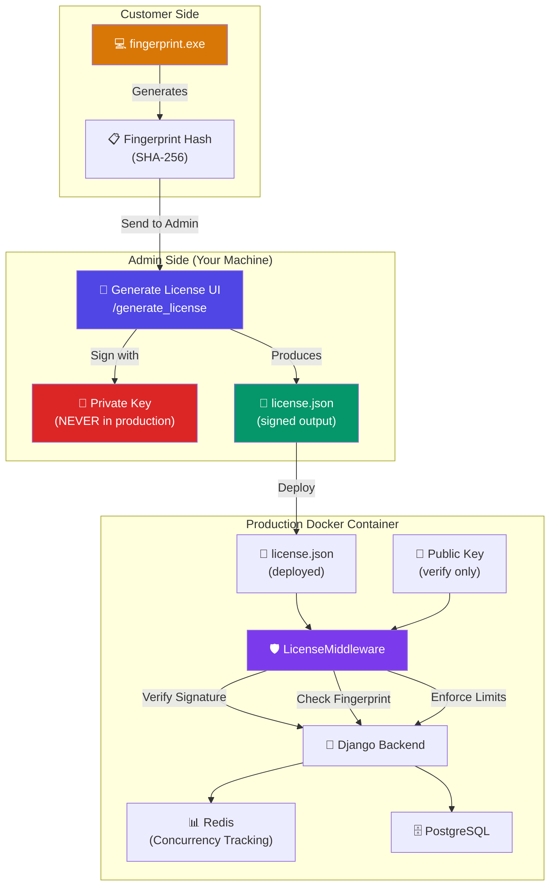
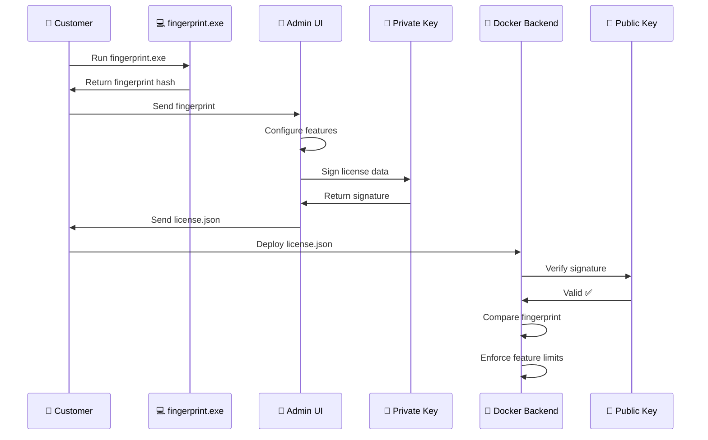
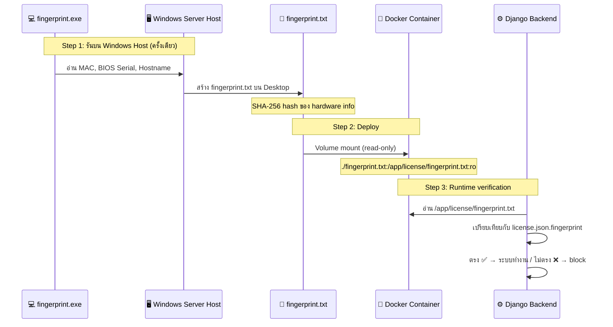
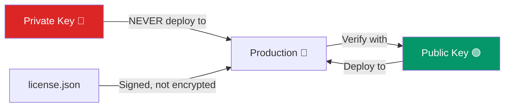

# 🔐 License Management System — Implementation Plan

## Overview

ระบบ License Management สำหรับ Web Application (Docker-based) ที่ครอบคลุม:
- **License Generation** — Admin tool สำหรับสร้าง/sign license
- **License Verification** — Backend middleware ตรวจสอบ license ทุก request
- **Feature Locking** — ควบคุม MainDatabase rows, concurrency, menu, config
- **Hardware Binding** — ผูก license กับ fingerprint ของเครื่อง
- **Fingerprint Collector** — โปรแกรม .exe สำหรับลูกค้าดึง fingerprint

---

## System Architecture



### License Flow (Step-by-Step)



---

## ❓ Answers to Key Questions

### 1. Feature Lock ควรถูก encode อยู่ใน License Data แล้ว sign ใช่ไหม?

**✅ ใช่ครับ** — Feature lock ทั้งหมดจะถูกรวมเป็น JSON object ใน license data แล้ว sign ทั้ง block พร้อมกัน ไม่ต้อง generate key ใหม่ทุก feature

```json
{
  "fingerprint": "sha256_hash",
  "features": {
    "max_main_db": 3,
    "max_concurrent_users": 10,
    "allowed_menus": ["dashboard", "report", "audio_records"],
    "config_flags": { "enable_export": true, "enable_ticket": false }
  },
  "issued_at": "2026-04-20T00:00:00Z",
  "expiry": "2027-04-20T00:00:00Z",
  "license_id": "LIC-2026-001"
}
```

ทั้ง block นี้จะถูก sign → signature เดียวครอบคลุมทุก feature → แก้ไขค่าใดค่าหนึ่ง = signature invalid

### 2. วิธีที่ปลอดภัยที่สุดในการ bind Docker container กับ hardware?

> [!CAUTION]
> **ปัญหาหลัก: Windows Server + Docker = อ่าน hardware ไม่ได้**
> Docker บน Windows ใช้ WSL2 / Hyper-V → container รันใน Linux VM ที่แยกจาก host
> → ไม่สามารถอ่าน MAC Address, BIOS Serial, หรือ hardware ใดๆ ของ Windows host ได้เลย

**✅ Solution: Pre-generated Fingerprint File (2-Step Approach)**



**ขั้นตอนปฏิบัติ:**

| Step | ทำที่ไหน | ทำอะไร |
|------|---------|--------|
| 1 | Windows Server Host | รัน `fingerprint.exe` → สร้างโฟลเดอร์ `seektrack_fngerprint` บน Desktop |
| 2 | ลูกค้า → Admin | ส่งโฟลเดอร์ `seektrack_fngerprint` กลับมา |
| 3 | Admin | ใช้ fingerprint hash สร้าง license.json |
| 4 | Admin → ลูกค้า | ส่ง license.json + public_key.pem กลับไป |
| 5 | Windows Server Host | วาง `fingerprint.txt` + `license.json` + `public_key.pem` ใน `./backend/license/` |
| 6 | Docker | Mount `./backend/license/` เข้า container (read-only) |
| 7 | Runtime | Backend อ่านไฟล์ → verify signature → เทียบ fingerprint → enforce limits |

**ทำไมวิธีนี้ปลอดภัย:**
- ✅ fingerprint.exe รันบน **host จริง** → เข้าถึง hardware ได้เต็มที่
- ✅ fingerprint.txt เป็น **read-only volume** → container แก้ไขไม่ได้
- ✅ fingerprint hash ถูก **encode ใน license.json** แล้ว sign → แก้ไข = signature invalid
- ✅ ย้าย license ไปเครื่องอื่น → fingerprint ไม่ตรง → ระบบ block
- ✅ ไม่ต้องพึ่งพา Docker hardware access ที่ไม่น่าเชื่อถือ

### 3. ควรใช้ RSA หรือ ECC?

**แนะนำ: RSA 2048-bit** เหตุผล:
- ✅ Library support ดีกว่า (`cryptography` package ที่มีอยู่แล้วใน requirements.txt)
- ✅ เข้าใจง่าย, debug/troubleshoot สะดวก
- ✅ Key size ไม่ใช่ปัญหา (license file ไม่ใช่ real-time communication)
- ✅ Mature, battle-tested

ECC เหมาะกว่าสำหรับ high-volume, real-time scenarios ซึ่งไม่ตรง use case นี้

### 4. วิธีจัดการ concurrency ที่ scale ดี?

**แนะนำ: Redis (มีอยู่แล้วใน stack)**

| Approach | Pros | Cons |
|----------|------|------|
| **Redis** ✅ | Fast, atomic, TTL support, already in stack | Need Redis availability |
| DB | Persistent, no extra dependency | Slower, lock contention |
| In-memory | Fastest | Lost on restart, no multi-process |

**Implementation:** ใช้ Redis Sorted Set เก็บ active sessions พร้อม TTL:
- Key: `license:active_sessions`
- Score: timestamp (last activity)
- Value: `user_id:session_key`
- Cleanup: Periodic sweep หรือ check ตอน login

---

## Proposed Changes

### Component 1: Fingerprint Collector Tool

> Python script ที่ build เป็น .exe ด้วย PyInstaller (มีอยู่ใน requirements.txt แล้ว)

#### [NEW] [fingerprint_collector.py](file:///c:/Users/ACER/Documents/GitHub/nt_playback/generate_license/fingerprint_collector.py)

```python
# Collects: MAC Address, Hostname, BIOS Serial (Windows WMI)
# Combines → SHA-256 hash → creates folder on Desktop
# Build: pyinstaller --onefile fingerprint_collector.py
```

**Output Behavior:**

เมื่อลูกค้ารัน `fingerprint.exe` จะ:

1. **สร้างโฟลเดอร์** `seektrack_fngerprint` บน Desktop ของลูกค้า
2. ภายในโฟลเดอร์ประกอบด้วย 2 ไฟล์:

```
Desktop/
└── seektrack_fngerprint/
    ├── fingerprint.txt        # Fingerprint hash (SHA-256) — ค่าเดียว
    └── fingerprint_log.txt    # Log ตรวจสอบว่า Success/Error fingerprint
```

**📄 fingerprint.txt** — เก็บเฉพาะ hash string บรรทัดเดียว:
```
a3f2b8c1d4e5f67890abcdef1234567890abcdef1234567890abcdef12345678
```

**📄 fingerprint_log.txt** — log รายละเอียดทั้งหมด สำหรับ ตรวจสอบ ว่า Success/Error:
```
=== NT Fingerprint Report ===
Generated: 2026-04-20 15:30:00
Status: Success/Error
---
Fingerprint (SHA-256): a3f2b8c1d4e5...
```

3. **แสดงผลบน console** — แสดง fingerprint hash + path ที่บันทึก
4. **ลูกค้าส่งโฟลเดอร์ `seektrack_fngerprint` กลับมาให้ Admin** (ทั้งโฟลเดอร์)

> [!TIP]
> Admin จะได้ทั้ง fingerprint hash (สำหรับใส่ใน license) และ log (สำหรับ verify ว่าข้อมูลถูกต้อง)

**Data Collection:**
- ดึง MAC Address (ทุก physical NIC)
- ดึง Hostname
- ดึง BIOS Serial Number (via `wmic` on Windows / `dmidecode` on Linux)
- ดึง OS version
- รวมค่า (MAC + Hostname + BIOS Serial) → SHA-256 → fingerprint hash
- บันทึกทั้ง hash และ raw data ลงไฟล์บน Desktop

---

### Component 2: License Generator (Admin Tool)

> Standalone web app ใน `/generate_license` — HTML + Vanilla JS + CSS (ไม่ต้อง framework)
> ทำงานฝั่ง client-side ทั้งหมด ใช้ Web Crypto API / หรือ Python backend เล็กๆ

#### Architecture Decision

> [!IMPORTANT]
> **เลือกแนวทาง: Python Flask mini-server + Modern HTML/CSS/JS UI**
> - Flask server จัดการ crypto operations (RSA key gen, signing)
> - Frontend เป็น HTML/CSS/JS modern UI
> - รันแยกจาก main app (admin tool ส่วนตัว)
> - Private key ไม่มีทาง leak ไป production

#### [NEW] [server.py](file:///c:/Users/ACER/Documents/GitHub/nt_playback/generate_license/server.py)

Flask server สำหรับ:
- `POST /api/generate-keys` — สร้าง RSA 2048 keypair, save to files
- `POST /api/generate-license` — รับ config, sign license, output license.json
- `GET /api/keys-status` — ตรวจสอบว่ามี keys อยู่แล้วหรือยัง
- `POST /api/load-keys` — โหลด keys จาก file ที่มีอยู่
- `GET /api/public-key` — ดาวน์โหลด public key สำหรับ deploy

#### [NEW] [index.html](file:///c:/Users/ACER/Documents/GitHub/nt_playback/generate_license/index.html)

Modern admin UI ประกอบด้วย:

**Section 1: Key Management**
- ปุ่ม Generate New Keypair
- แสดงสถานะ keys (มี/ไม่มี)
- ดาวน์โหลด Public Key

**Section 2: License Configuration**
- Fingerprint input field
- License ID / Customer name
- Expiry date picker
- Main Database limit (number input)
- Concurrent users limit (number input)
- Menu access (checkbox list — dynamic)
- Config flags (toggle switches)

**Section 3: Generated License**
- Preview JSON
- Download license.json
- Copy to clipboard

**Design:**
- Dark theme พร้อม glassmorphism
- สีโทน violet/indigo (#4f46e5, #7c3aed)
- Google Font: Inter
- Smooth animations, hover effects
- Responsive layout

#### [NEW] [style.css](file:///c:/Users/ACER/Documents/GitHub/nt_playback/generate_license/style.css)

#### File Structure:
```
generate_license/
├── server.py              # Flask backend (crypto operations)
├── index.html             # Admin UI
├── style.css              # Styles
├── app.js                 # Frontend logic
├── fingerprint_collector.py  # Customer fingerprint tool
├── keys/                  # Generated keys (gitignore!)
│   ├── private_key.pem
│   └── public_key.pem
└── output/                # Generated licenses
    └── license.json
```

---

### Component 3: Backend License Verification

> ใส่เข้าไปใน Django backend เดิม — middleware + service layer

#### [NEW] [license_service.py](file:///c:/Users/ACER/Documents/GitHub/nt_playback/backend/apps/core/utils/license_service.py)

**Core service class `LicenseService`:**
- `load_license()` — อ่าน `/app/license/license.json`
- `verify_signature()` — ตรวจ signature ด้วย public key
- `get_host_fingerprint()` — อ่าน fingerprint จาก `/app/license/fingerprint.txt` (mounted file จาก host)
- `verify_fingerprint()` — เปรียบเทียบ fingerprint
- `is_expired()` — ตรวจวันหมดอายุ
- `get_feature_limits()` — return feature config จาก license
- `check_main_db_limit()` — ตรวจจำนวน rows ใน tb_maindatabase
- `check_concurrency()` — ตรวจจำนวน active sessions (Redis)
- `is_menu_allowed(menu_name)` — ตรวจสิทธิ์ menu
- `is_config_enabled(flag_name)` — ตรวจ config flag

#### [NEW] [license_middleware.py](file:///c:/Users/ACER/Documents/GitHub/nt_playback/backend/apps/core/utils/license_middleware.py)

**Django middleware `LicenseEnforcementMiddleware`:**
- ตรวจ license validity ทุก request (cached result — ไม่ต้อง verify ทุกครั้ง)
- Block system ถ้า license invalid / fingerprint ไม่ตรง / expired
- Inject license features เข้า `request.license_features`
- ตรวจ concurrency limit ตอน login (integrate กับ login view)

#### [MODIFY] [middleware.py](file:///c:/Users/ACER/Documents/GitHub/nt_playback/backend/apps/core/utils/middleware.py)

ไม่แก้ไข middleware เดิม — เพิ่ม middleware ใหม่แยกต่างหาก

#### [MODIFY] [settings.py](file:///c:/Users/ACER/Documents/GitHub/nt_playback/backend/config/settings.py)

เพิ่ม:
```python
MIDDLEWARE = [
    ...
    'apps.core.utils.license_middleware.LicenseEnforcementMiddleware',  # NEW
]

# License settings — ทุกไฟล์อยู่ใน ./backend/license/ (mounted read-only)
LICENSE_DIR = BASE_DIR / 'license'
LICENSE_FILE_PATH = LICENSE_DIR / 'license.json'
LICENSE_PUBLIC_KEY_PATH = LICENSE_DIR / 'public_key.pem'
LICENSE_FINGERPRINT_PATH = LICENSE_DIR / 'fingerprint.txt'  # Pre-generated on Windows host
```

#### [MODIFY] [views.py (login)](file:///c:/Users/ACER/Documents/GitHub/nt_playback/backend/apps/login/views.py)

เพิ่ม concurrency check ก่อน login:
```python
# Before creating JWT token:
from apps.core.utils.license_service import LicenseService
license_svc = LicenseService()
if not license_svc.check_concurrency():
    return JsonResponse({'error': 'Maximum concurrent users reached.'}, status=403)
# After successful login:
license_svc.register_session(user, session_key)
```

#### [NEW] License files directory

```
backend/
└── license/
    ├── license.json       # Deployed license file
    └── public_key.pem     # Public key for verification
```

---

### Component 4: MainDatabase Row Lock

#### [NEW] [db_limit_middleware.py](file:///c:/Users/ACER/Documents/GitHub/nt_playback/backend/apps/core/utils/db_limit_middleware.py)

**หรือ** integrate เข้า `license_service.py`:

- Intercept INSERT/DELETE operations บน `tb_maindatabase`
- ตรวจจำนวน rows ปัจจุบัน vs. license limit
- ถ้า rows == limit → block INSERT/DELETE, allow UPDATE only
- Implementation: Django signal `pre_save` + `pre_delete` บน `MainDatabase` model

```python
from django.db.models.signals import pre_save, pre_delete
from django.dispatch import receiver
from apps.core.model.authorize.models import MainDatabase

@receiver(pre_save, sender=MainDatabase)
def check_main_db_insert_limit(sender, instance, **kwargs):
    if instance.pk is None:  # INSERT (new record)
        license_svc = LicenseService()
        limit = license_svc.get_feature_limits().get('max_main_db')
        if limit and MainDatabase.objects.count() >= limit:
            raise ValidationError('MainDatabase row limit reached per license.')

@receiver(pre_delete, sender=MainDatabase)
def check_main_db_delete_limit(sender, instance, **kwargs):
    license_svc = LicenseService()
    limit = license_svc.get_feature_limits().get('max_main_db')
    if limit and MainDatabase.objects.count() <= limit:
        raise ValidationError('Cannot delete: MainDatabase is at license limit.')
```

---

### Component 5: Frontend License Integration

#### [NEW] [license.store.js](file:///c:/Users/ACER/Documents/GitHub/nt_playback/frontend/src/stores/license.store.js)

Pinia store สำหรับ:
- `fetchLicenseInfo()` — ดึง license features จาก backend API
- `isMenuAllowed(menuName)` — ตรวจสิทธิ์ menu ถ้าไม่มีค่าอะไรแปลว่าไม่ได้ lock
- `isConfigEnabled(flagName)` — ตรวจ config flag ถ้าไม่มีค่าอะไรแปลว่าไม่ได้ lock
- `maxConcurrentUsers` — reactive ref
- `maxMainDb` — reactive ref
- `expiryDate` — reactive ref

#### [MODIFY] [LeftBar.vue](file:///c:/Users/ACER/Documents/GitHub/nt_playback/frontend/src/components/LeftBar.vue)

เพิ่ม license-aware menu filtering:
```javascript
// Hide/show menu items based on license
const licenseStore = useLicenseStore()
const isMenuVisible = (menuName) => licenseStore.isMenuAllowed(menuName)
```

#### [NEW] Backend API endpoint

```python
# GET /api/license-info/
# Returns sanitized license features (NO fingerprint/signature)
```

---

### Component 6: Docker Integration (Windows Server)

> [!IMPORTANT]
> เนื่องจากลูกค้าใช้ **Windows Server** + Docker → ใช้แนวทาง **pre-generated fingerprint file**
> ไม่ mount hardware paths เข้า container (ทำไม่ได้บน Windows)

#### [MODIFY] [docker-compose.yml](file:///c:/Users/ACER/Documents/GitHub/nt_playback/docker-compose.yml)

```yaml
services:
  backend:
    volumes:
      - ./backend:/app
      - ./backend/license:/app/license:ro    # License files (read-only)
      # ⬆️ ภายใน ./backend/license/ ต้องมี:
      #   - license.json        (signed license)
      #   - public_key.pem      (public key สำหรับ verify)
      #   - fingerprint.txt     (SHA-256 จาก fingerprint.exe)
```

#### Deployment Checklist (สำหรับลูกค้า)

```
./backend/license/
├── license.json       ← ได้จาก Admin (signed license)
├── public_key.pem     ← ได้จาก Admin (public key)
└── fingerprint.txt    ← ได้จากรัน fingerprint.exe บน host นี้
```

**ขั้นตอน deploy:**
1. รัน `fingerprint.exe` บน Windows Server host → ได้โฟลเดอร์ `seektrack_fngerprint` บน Desktop
2. ส่งโฟลเดอร์ `seektrack_fngerprint` ให้ Admin
3. Admin สร้าง license → ส่ง `license.json` + `public_key.pem` กลับมา
4. วาง 3 ไฟล์ลงใน `./backend/license/`
5. `docker-compose up -d` → ระบบพร้อมใช้งาน

---

## Database Schema

ไม่ต้องเพิ่ม table ใหม่ — license ทำงานผ่าน file-based verification

**Existing tables ที่เกี่ยวข้อง:**
| Table | Role in License System |
|-------|----------------------|
| `tb_license` | (Existing) อาจ update เพื่อ cache license info |
| `tb_maindatabase` | Row count ถูก enforce ตาม license limit |
| `tb_userprofile` | Session tracking สำหรับ concurrency |

**Redis keys ที่จะใช้:**
| Key | Type | Purpose |
|-----|------|---------|
| `license:active_sessions` | Sorted Set | Track active user sessions |
| `license:cache` | String (JSON) | Cache parsed license data (TTL 5min) |
| `license:valid` | String | Cache validation result (TTL 5min) |

---

## Security Measures



1. **Private Key** → อยู่ใน `/generate_license/keys/` เท่านั้น (gitignore)
2. **Public Key** → deploy ไป production สำหรับ verify
3. **License file** → signed ด้วย RSA, แก้ไข JSON = signature invalid
4. **Fingerprint** → SHA-256 hash ของ hardware info, ต้องตรงกับ host
5. **Cache** → License validation result cached 5 นาที (performance)
6. **.gitignore** → เพิ่ม `generate_license/keys/`, `generate_license/output/`

### Anti-Crack Measures

- ❌ ไม่สามารถแก้ไข license.json ได้ (signature จะ invalid)
- ❌ ไม่สามารถใช้ license จากเครื่องอื่นได้ (fingerprint ไม่ตรง)
- ❌ ไม่สามารถ sign license ใหม่ได้ (ไม่มี private key)
- ❌ ไม่สามารถ bypass middleware ได้ (block ทุก request)
- ⚠️ ถ้า user มี access ถึง source code ก็สามารถ comment middleware ได้ → ใช้ obfuscation หรือ compiled backend (ขั้นสูง — optional)

---

## File Summary

| # | File | Action | Description |
|---|------|--------|-------------|
| 1 | `generate_license/fingerprint_collector.py` | NEW | เครื่องมือดึง hardware fingerprint |
| 2 | `generate_license/server.py` | NEW | Flask server สำหรับ crypto operations |
| 3 | `generate_license/index.html` | NEW | Admin UI (modern dark theme) |
| 4 | `generate_license/style.css` | NEW | CSS styles |
| 5 | `generate_license/app.js` | NEW | Frontend JavaScript logic |
| 6 | `backend/apps/core/utils/license_service.py` | NEW | Core license verification service |
| 7 | `backend/apps/core/utils/license_middleware.py` | NEW | Django middleware enforcement |
| 8 | `backend/config/settings.py` | MODIFY | เพิ่ม middleware + license config |
| 9 | `backend/apps/login/views.py` | MODIFY | เพิ่ม concurrency check |
| 10 | `backend/license/public_key.pem` | NEW | Public key (placeholder) |
| 11 | `frontend/src/stores/license.store.js` | NEW | License Pinia store |
| 12 | `docker-compose.yml` | MODIFY | เพิ่ม license volume mount |
| 13 | `.gitignore` | MODIFY | เพิ่ม keys/output exclusion |

---

## User Review Required

> [!IMPORTANT]
> **Menu List สำหรับ License** — ต้องการ list ของ menu ทั้งหมดที่ต้องการ lock/unlock ได้
> ตอนนี้เห็นจาก router: `Home`, `UserManagement`, `Role`, `Group`, `SystemLogs`, `AuditLogs`, `TicketHistory`, `TicketManagement`, `DelegateManagement`, `Profile`, `SettingColumnAudioRecord`
> ต้องการเพิ่ม/ลด menu ไหนบ้าง?
> ไม่ต้องเพิ่ม/ลด เพราะว่าอันนี้จะเป็นฟีเจอร์ในอนาคต ตอนนี้ที่ต้ิงทำหลักๆ จะมี Lock DB และ limit Concurrency

> [!IMPORTANT]
> **Config Flags** — ต้องการ config flags อะไรบ้าง?
> ตัวอย่าง: `enable_export`, `enable_ticket`, `enable_file_share`, `enable_audio_player`
> ช่วยระบุ list ที่ต้องการ

> [!NOTE]
> **Fingerprint บน Windows Server** — ✅ แก้ไขแล้ว
> ใช้แนวทาง pre-generated fingerprint file: ลูกค้ารัน `fingerprint.exe` บน host → ได้ `fingerprint.txt` → mount เข้า Docker container เป็น read-only volume

> [!IMPORTANT]
> **Concurrency — Force Disconnect** — ต้องการ force disconnect user เก่าเมื่อ limit เต็มหรือไม่?
> Option A: Block user ใหม่ (แนะนำ)
> Option B: Kick user เก่าสุดออก (aggressive)

---

## Verification Plan

### Automated Tests
1. **License signing/verification** — Unit test ใน `generate_license/` ว่า sign → verify ตรง
2. **Tamper detection** — แก้ไข license.json → verify ต้อง fail
3. **Fingerprint mismatch** — ใส่ fingerprint ผิด → system block
4. **MainDatabase limit** — INSERT เกิน limit → error
5. **Concurrency limit** — Login เกิน limit → rejected

### Manual Verification
1. รัน `generate_license/server.py` → เปิด UI → สร้าง keypair → สร้าง license
2. Deploy license.json + public_key.pem ไป `backend/license/`
3. Start Docker → verify system boots correctly with valid license
4. Test limit enforcement ผ่าน browser
