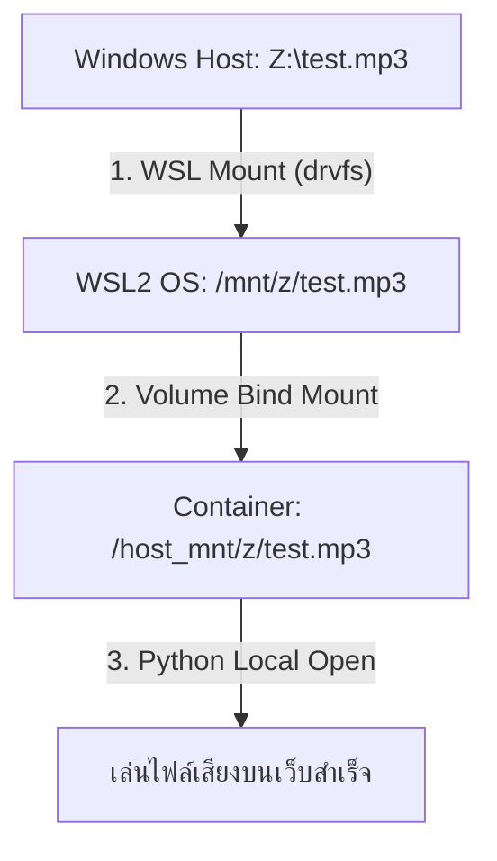

# คู่มือการตั้งค่าและการเข้าถึงไฟล์เสียงบน Network Share / Mapped Drive

คู่มือนี้อธิบายวิธีการตั้งค่าและการเข้าถึงไฟล์เสียงที่ถูกเก็บไว้บนฮาร์ดดิสก์เครื่องหลัก (Local Drive) และบนไดรฟ์เครือข่าย (Network Mapped Drive เช่น `Z:`, `Y:`) เพื่อให้แอปพลิเคชัน Django (ซึ่งรันอยู่ภายใน Docker Container) สามารถสตรีมเล่นเสียงได้โดยตรง

---

## 🏗️ โครงสร้างการทำงาน (Architecture)

เนื่องจาก Docker ทำงานอยู่ภายในสภาพแวดล้อมระบบปิด (Sandbox) บนระบบปฏิบัติการ Linux (WSL2) ทำให้ไม่สามารถมองเห็นไดรฟ์เครือข่ายของ Windows ได้โดยตรง เราจึงตั้งค่าโครงสร้างการเชื่อมโยงข้อมูลดังนี้:



1. **WSL2 Mount**: ไดรฟ์เครือข่ายของ Windows (เช่น `Z:`) จะถูกนำไปเชื่อมต่อเข้ากับไดเรกทอรีของ WSL2 ที่ `/mnt/z` ผ่านระบบไฟล์ `drvfs`
2. **Volume Mount**: โฟลเดอร์ `/mnt` ของ WSL2 ทั้งหมดจะถูกแชร์เข้าไปที่โฟลเดอร์ `/host_mnt` ใน Container ผ่านไฟล์ [docker-compose.yml](file:///c:/Users/ACER/Documents/GitHub/nt_playback/docker-compose.yml)
3. **Dynamic Translation**: โค้ดไพทอนใน [views.py](file:///c:/Users/ACER/Documents/GitHub/nt_playback/backend/apps/home/views.py) จะแปลงพาร์ทอัตโนมัติเมื่อเห็นการเรียกใช้งานไดรฟ์ เช่น `Z:\test.mp3` ➡️ `/host_mnt/z/test.mp3`

---

## 🛠️ ขั้นตอนการตั้งค่าเครื่อง Server (เมื่อมีไดรฟ์เครือข่ายใหม่)

หากมีการเพิ่มไดรฟ์เครือข่ายใหม่ (เช่น ไดรฟ์ `Z:`, `Y:`, `X:` เป็นต้น) และต้องการนำมาเปิดเล่นผ่านหน้าเว็บ ให้ดำเนินการตามขั้นตอนดังต่อไปนี้:

### ขั้นตอนที่ 1: ตรวจสอบและสร้างจุดเชื่อมโยง (Mount Point) บน Windows
เปิด **PowerShell** ในฐานะ Administrator บนเครื่อง Windows Server แล้วรันคำสั่งด้านล่างนี้ (เปลี่ยนตัวอักษรไดรฟ์และชื่อโฟลเดอร์ตามต้องการ):

```powershell
# 1. สร้างโฟลเดอร์ปลายทางในระบบ Linux (WSL2)
wsl mkdir -p /mnt/z

# 2. เชื่อมโยงไดรฟ์ Z: ของ Windows เข้าไปยังพาร์ทดังกล่าว
wsl mount -t drvfs 'Z:' /mnt/z
```

### ขั้นตอบที่ 2: ตรวจสอบความถูกต้อง
รันคำสั่งนี้บน PowerShell เพื่อดูว่าไฟล์จากไดรฟ์เน็ตเวิร์กเชื่อมเข้ามาสำเร็จแล้วหรือไม่:
```powershell
wsl ls /mnt/z
```
> [!TIP]
> หากการรันคำสั่งดังกล่าวแสดงรายชื่อไฟล์เสียงที่อยู่บนไดรฟ์เครือข่าย (เช่น `test.mp3`) แสดงว่าการเชื่อมโยงระบบสำเร็จเรียบร้อยแล้ว

---

## 💾 วิธีตั้งค่าให้เปิดไดรฟ์อัตโนมัติเมื่อรีสตาร์ทเครื่อง (Persistence Mount)

> [!WARNING]
> การ Mount ด้วยคำสั่งปกติในขั้นตอนด้านบนจะ**หลุดทันทีหากมีการรีสตาร์ทเครื่อง Server หรือปิดเปิด WSL2/Docker ใหม่** เพื่อความสะดวกในระยะยาว แนะนำให้ตั้งค่าตามวิธีใดวิธีหนึ่งด้านล่างนี้เพื่อให้ระบบเชื่อมต่อไดรฟ์เครือข่ายให้อัตโนมัติ:

### ทางเลือกที่ A: ใช้ Task Scheduler ของ Windows (แนะนำ - ง่ายที่สุด)
สร้างสคริปต์สั้น ๆ สั่งรันตอนเปิดเครื่อง Windows เสมอ:

1. เปิดโปรแกรม **Notepad** แล้วเขียนคำสั่งดังนี้:
   ```powershell
   Start-Sleep -Seconds 10
   wsl mkdir -p /mnt/z
   wsl mount -t drvfs 'Z:' /mnt/z
   ```
2. บันทึกไฟล์ชื่อ `mount_drives.ps1` ไว้ในเครื่อง (เช่น `C:\Scripts\mount_drives.ps1`)
3. เปิดโปรแกรม **Task Scheduler** บน Windows:
   * คลิก **Create Basic Task** ตั้งชื่อเป็น "Auto Mount WSL Network Drives"
   * เลือก Trigger เป็น **When the computer starts**
   * Action เลือก **Start a program**
   * ช่อง Program/script ใส่: `powershell.exe`
   * ช่อง Add arguments ใส่: `-ExecutionPolicy Bypass -File "C:\Scripts\mount_drives.ps1"`
   * ที่ตั้งค่าเงื่อนไขของ Task ให้เลือก **Run whether user is logged on or not** และเลือกสิทธิ์เป็น **Run with highest privileges**

---

### ทางเลือกที่ B: ตั้งค่าผ่านไฟล์ `/etc/fstab` ใน WSL2
สำหรับแอดมินระบบที่เชี่ยวชาญ Linux สามารถระบุให้ Linux Mount อัตโนมัติได้ดังนี้:

1. เปิด Terminal ของ WSL2 หรือเข้าผ่าน PowerShell ด้วยคำสั่ง:
   ```powershell
   wsl
   ```
2. แก้ไขไฟล์การ Mount ด้วยสิทธิ์ root:
   ```bash
   sudo nano /etc/fstab
   ```
3. เพิ่มบรรทัดนี้ไปที่ท้ายไฟล์ (แก้ไขตัวอักษรไดรฟ์เป็นของตนเอง):
   ```text
   Z: /mnt/z drvfs defaults,noatime,uid=1000,gid=1000,umask=22,fmask=11 0 0
   ```
4. กด `Ctrl+O` เพื่อเซฟ และ `Ctrl+X` เพื่อออกจากโปรแกรมแก้ไข

---

## 🎵 รูปแบบการส่งพาธไฟล์เสียงผ่าน API

ระบบใหม่ได้รับการอัปเกรดให้รองรับการส่งพาธไฟล์เสียงได้ 2 รูปแบบอย่างยืดหยุ่น:

| รูปแบบการส่งพาธ | ตัวอย่างค่า `file_path` | ตัวอย่างค่า `file_name` | คำอธิบายการทำงาน |
| :--- | :--- | :--- | :--- |
| **แบบที่ 1: ผ่านชื่อไดรฟ์ (แนะนำ)** | `Z:\` หรือ `Z:\Recordings\Music\` | `test.mp3` | **ทำงานเสมือนไฟล์ในเครื่อง (เร็วที่สุด)**: ไพทอนจะสตรีมอ่านไฟล์จาก `/host_mnt/z/...` ไปส่งให้เว็บโดยตรง |
| **แบบที่ 2: ผ่าน UNC Path** | `\\NICHETEL-DOMAIN\Users\Administrator\Desktop\` | `test.mp3` | **ทำงานผ่านสตรีมเน็ตเวิร์ก**: ไพทอนจะดึงไฟล์ผ่าน SMB Client มาเก็บที่ temp ชั่วคราว สตรีมเสร็จแล้วระบบจะลบไฟล์ทิ้งอัตโนมัติ |
