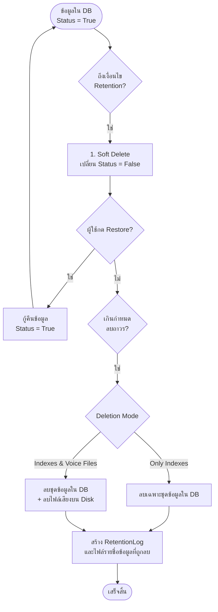

# คู่มืออธิบายระบบจัดเก็บและทำลายข้อมูล (Data Retention System)

ระบบ **Data Retention** ออกแบบมาเพื่อทำหน้าที่จัดการอายุขัยและพื้นที่จัดเก็บข้อมูลบันทึกเสียง (Audio Records) และชุดข้อมูล (Indexes) ภายในระบบ เพื่อควบคุมไม่ให้ไฟล์เสียงและฐานข้อมูลมีขนาดใหญ่เกินไป โดยระบบจะมีโครงสร้างการลบแบบปลอดภัย 2 ขั้นตอน (Soft Delete และ Permanent Delete) เพื่อให้ผู้ดูแลระบบมีเวลาในการตรวจสอบและกู้คืนไฟล์ได้หากจำเป็น

---

## 1. คอนเซ็ปต์การทำงานของระบบ (How It Works)

ระบบทำงานด้วยกลไก **Double-Step Deletion** เพื่อความปลอดภัยในการรักษาข้อมูล:

### การลบ 2 ขั้นตอน (Double-Step Deletion)
1. **Soft Delete (การลบชั่วคราว)**:
   - ระบบจะสแกนหาไฟล์ที่เข้าเกณฑ์ และอัปเดตค่าฟิลด์ `status` ในฐานข้อมูลจาก `True` เป็น `False` 
   - บันทึก `Task` งานไว้ในฟิลด์ `retention_task_id` เพื่อระบุว่า Task ไหนสั่งลบ
   - ขั้นตอนนี้ ข้อมูลจะถูกซ่อนไม่ให้แสดงผลในหน้า Home แต่**ไฟล์เสียงจริงและชุดข้อมูลในระบบยังคงอยู่** ผู้ใช้ยังสามารถกด **Restore (กู้คืน)** กลับมาได้
2. **Permanent Delete (การลบถาวร)**:
   - ทำงานอัตโนมัติในเบื้องหลัง (Background Scheduler) ทุก ๆ 1 นาที
   - ค้นหาข้อมูลที่มี `status = False` และมีระยะเวลาหยุดใช้งานนานเกินกว่าเงื่อนไขลบถาวร (เช่น เกิน 30 วันนับจากวันที่ Soft Delete)
   - ดำเนินการ **ลบไฟล์เสียงจริงออกจากแชร์โฟลเดอร์ (Network Share)** และ **ลบเรกคอร์ดของไฟล์นั้นออกจากตารางฐานข้อมูลหลักโดยถาวร** ไม่สามารถกู้คืนได้อีก

---

## 2. ขั้นตอนการทำงานฝั่งหน้าบ้าน (Frontend Workflow)

หน้าจอระบบจะแบ่งการควบคุมออกเป็น 2 แท็บหลัก:

### A. แท็บ Run on a Schedule (การตั้งค่าตารางเวลาลบอัตโนมัติ)
1. ผู้ใช้กำหนดเงื่อนไขการเลือกข้อมูล (Retention Period) เช่น ข้อมูลที่เก่ากว่า 1 ปี (`Older Than 1 Year`) หรือเลือกกำหนดช่วงเวลาลบเฉพาะเจาะจง (`Date Range`)
2. กำหนดเวลาและรอบการรัน (How often & What day & What time) เช่น ให้ระบบทำงานทุกวันจันทร์ เวลา 01:00 น.
3. กำหนดว่าจะลบเฉพาะชุดข้อมูล (`Only Indexes`) หรือลบทั้งไฟล์เสียงและชุดข้อมูล (`Indexes & Voice Files`)
4. เมื่อกด **Save and Run**:
   - ระบบจะบันทึกการตั้งค่าลงตาราง `auto_retention_config`
   - ตั้งสถานะงานของ Schedule ในตารางงาน (Task List) เป็น `READY` เพื่อรอการรันเมื่อถึงเวลา

### B. แท็บ Immediately Retention (การสั่งลบทันทีแบบแมนนวล)
1. ใช้สำหรับกรณีต้องการสั่งเคลียร์ข้อมูลทันที เช่น เลือกข้อมูลระหว่างวันที่ `2024-01-01` ถึง `2024-03-31`
2. เมื่อกดยืนยัน ระบบจะทำคำสั่ง **Soft Delete** ทันที และบันทึกประวัติลง Task List ด้วยสถานะ `RUNNING` 

### C. การควบคุมปุ่มการทำงานใน Task List
- **ปุ่ม Play (Start)**: แสดงเมื่อ Schedule อยู่ในสถานะ `STOPPED` เพื่อสั่งเปิดใช้งานระบบลบอัตโนมัติตามกำหนดเวลาอีกครั้ง (สถานะกลับเป็น `READY`)
- **ปุ่ม Stop (Stop)**: แสดงเมื่อ Schedule อยู่ในสถานะ `READY` เพื่อสั่งปิดการทำงานลบตามรอบเวลา (สถานะเปลี่ยนเป็น `STOPPED`) และหากระบบกำลังทำงานอยู่ (`RUNNING`) จะไม่สามารถกดหยุดได้เพื่อความปลอดภัยของข้อมูล
- **ปุ่ม Restore (Undo)**: แสดงเฉพาะงานที่สถานะเป็น `RUNNING` เพื่อดึงข้อมูลทั้งหมดที่เคยสั่งลบชั่วคราวในรอบงานนั้น ๆ กลับคืนมาทั้งหมด (ทำได้ก่อนที่จะโดนลบถาวร)

---

## 3. ขั้นตอนการทำงานฝั่งหลังบ้าน (Backend & Scheduler Workflow)

หลังบ้านพัฒนาด้วย **Django REST Framework** ทำงานร่วมกับ **APScheduler** ในการควบคุมการทำงานพื้นหลัง:

### A. API Endpoints ที่สำคัญ
- `POST /api/v1/retention/manual/`: รับคำสั่งลบทันที (Manual Soft Delete)
- `PUT /api/v1/retention/auto/`: บันทึกการตั้งค่าตารางเวลาลบอัตโนมัติ (Schedule Config)
- `POST /api/v1/retention/<id>/start/`: เปิดใช้งานตารางเวลาลบข้อมูล
- `POST /api/v1/retention/<id>/stop/`: ปิดใช้งานตารางเวลาลบข้อมูล
- `POST /api/v1/retention/<id>/restore/`: สั่งดึงข้อมูลที่เคยลบชั่วคราวกลับมาเป็น Active
- `GET /api/v1/retention/logs/`: ดึงข้อมูล Audit Log และประวัติการรันทั้งหมดมาแสดงผล

### B. Background Scheduler (APScheduler Jobs)
ระบบตั้งการทำงานเบื้องหลัง 2 ตัวรันบนเซิร์ฟเวอร์หลัก:

#### Job 1: `execute_auto_retention_job` (ทำงานตรวจรอบเวลาทุก 10 วินาที)
1. โหลดการตั้งค่าจาก `AutoRetentionConfig`
2. หากตารางเวลาเปิดใช้งานอยู่ (`is_active = True`) ระบบจะนำเวลาปัจจุบันมาเทียบกับเงื่อนไขตารางรัน (วัน/เวลา/ความถี่)
3. หากตรงตามเวลาและยังไม่ได้รันในวันปัจจุบัน:
   - นำเงื่อนไขลบ (เช่น เกิน 6 เดือน) มาคำนวณหาวันสิ้นสุด (Cutoff Date)
   - ค้นหา `Record` ในตาราง `tb_audioinfo` ที่ `status = True` และเก่ากว่า Cutoff Date
   - ดำเนินการอัปเดตเป็น `status = False` (Soft Delete) และผูก `retention_task_id = 10001`
   - เขียนบันทึกเหตุการณ์ลง `UserLog` ในชื่อ **`Complete Soft Delete Schedule Retention`** บันทึกจำนวน `Record` และวันที่รันไว้แบบถาวร

#### Job 2: `execute_permanent_delete_job` (ทำงานตรวจสอบทุก 1 นาที)
1. ดึงข้อมูลจำนวนวันที่ถูกตั้งค่าลบถาวร (เช่น 30 วัน)
2. ค้นหา `Record` ข้อมูลที่มีสถานะ `status = False` และมีวันเวลาที่สั่ง Soft Delete (`retention_date`) นานเกินกว่าจำนวนวันดังกล่าว
3. วนลูปเพื่อทำลายข้อมูล:
   - **ลบไฟล์จริง**: หากค่า `delete_option = VOICE_AND_INDEX` ระบบจะเข้าไปตรวจสอบความพร้อมใช้งานของไดเรกทอรีแชร์ และสั่งลบไฟล์จริงบน Disk
   - **ลบชุดข้อมูล**: ทำการลบข้อมูล Record ดังกล่าวในฐานข้อมูลจริง ๆ (ลบออกจากตาราง `tb_audiofile` และ `tb_audioinfo` ถาวร)
4. เขียนประวัติสรุปการลบถาวรลงฐานข้อมูลตาราง `RetentionLog` พร้อมทั้งสร้างไฟล์ Text รายงานรายชื่อไฟล์ที่ถูกลบถาวรทั้งหมดในรอบการรันนั้น ๆ

---

## 4. ตารางเปรียบเทียบสถานะงาน (Task Status Definitions)

| สถานะงาน (Status) | ความหมาย | Action ที่สามารถทำได้ |
| :--- | :--- | :--- |
| **READY** | ตารางเวลาเปิดใช้งานอยู่ และรอถึงรอบเวลาการทำงานถัดไป | หยุดทำงาน (Stop) |
| **RUNNING** | ระบบอยู่ระหว่างกระบวนการลบชั่วคราว (Soft Delete) และอยู่ในคิวรอการทำลายถาวร | กู้คืนข้อมูล (Restore) |
| **STOPPED** | ตารางเวลาถูกปิดใช้งาน ระบบจะไม่สแกนหาไฟล์หรือลบข้อมูลตามรอบ | เริ่มทำงาน (Start) |
| **RESTORED** | ข้อมูลทั้งหมดในรอบงานนั้นได้รับการกู้คืนกลับสู่สถานะปกติเรียบร้อยแล้ว | - |
| **PERMANENT DELETE** | ข้อมูลและไฟล์จริงถูกทำลายถาวรเรียบร้อยแล้ว  | - |
