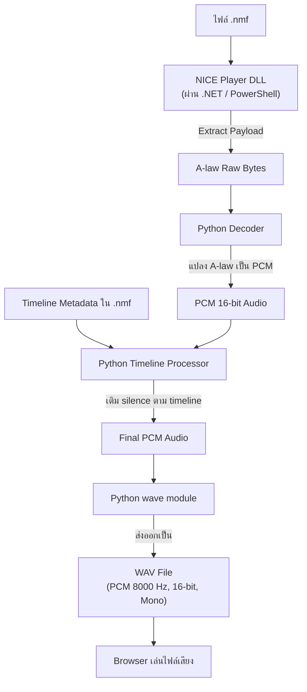
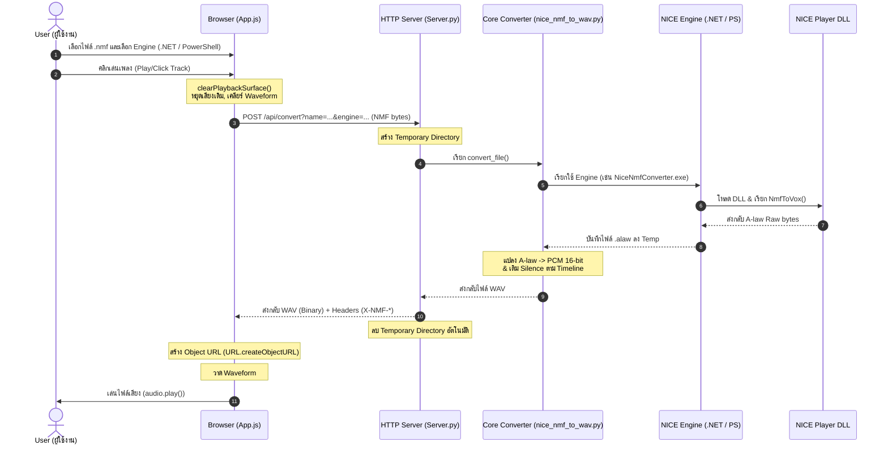

# NICE NMF Integration Guide

เอกสารนี้สรุปการทำงานของระบบแปลงไฟล์เสียง NICE `.nmf` เป็น `.wav` ในโปรเจคนี้ สำหรับให้ทีม dev นำไป integrate กับระบบเดิมได้ โดยครอบคลุมทั้งโหมด `PowerShell` และ `.NET`

## ภาพรวม

ระบบนี้ไม่ได้ถอดรหัส/แปลง `.nmf` ด้วย algorithm ที่เขียนเองทั้งหมด แต่ใช้ library ของ NICE Player ที่ติดตั้งอยู่บนเครื่อง server เป็นตัวเปิด payload ด้านใน `.nmf`

ตำแหน่ง NICE runtime ที่ใช้อยู่:

```text
C:\Program Files (x86)\NICE Systems\NICE Player Release 6
```

flow หลัก:

```text
.nmf
-> NICE DLL แปลง media payload เป็น A-law raw bytes
-> Python แปลง A-law เป็น PCM 16-bit
-> Python เติม timeline silence ถ้าพบ timestamp ใน NMF
-> Python เขียน/ส่งออกเป็น PCM WAV 8000 Hz mono
-> Browser เล่น WAV ได้ทันที
```



ผลลัพธ์สุดท้ายเป็น:

```text
PCM WAV
Sample rate: 8000 Hz
Channels: 1
Sample width: 16-bit
```

## โครงสร้างไฟล์สำคัญ

```text
Nice/
├─ start_nmf_player.bat
├─ nmf_web_player/
│  ├─ server.py
│  ├─ index.html
│  ├─ app.js
│  └─ styles.css
└─ tools/
   ├─ nice_nmf_to_wav.py
   ├─ try_nice_nmf_convert.ps1
   ├─ NiceNmfConverter.cs
   └─ NiceNmfConverter.exe
```

หน้าที่แต่ละไฟล์:

```text
start_nmf_player.bat
```

ใช้เปิด web server ที่ port `9797` และรันด้วย `python -B` เพื่อไม่ใช้ bytecode cache เก่า

```text
nmf_web_player/server.py
```

HTTP server สำหรับหน้าเว็บ และ API `/api/convert` สำหรับรับ `.nmf` แล้วส่ง `.wav` กลับ

```text
nmf_web_player/app.js
```

ฝั่ง browser: เลือกไฟล์, เลือก mode, ส่งไฟล์ไปแปลง, รับ WAV, วาด waveform, เล่นเสียง, แสดงเวลาแปลง

```text
tools/nice_nmf_to_wav.py
```

core converter ฝั่ง Python: เรียก engine PowerShell หรือ .NET เพื่อให้ NICE DLL extract เป็น A-law แล้วแปลงต่อเป็น WAV

```text
tools/try_nice_nmf_convert.ps1
```

PowerShell bridge เดิม ใช้ 32-bit PowerShell โหลด NICE DLL แล้วเรียก `MediaFileConverter.NmfToVox`

```text
tools/NiceNmfConverter.cs
tools/NiceNmfConverter.exe
```

.NET bridge ใหม่แบบ x86 เรียก NICE DLL โดยตรง ไม่ผ่าน PowerShell

## Runtime dependency

server ต้องมี NICE Player ติดตั้ง และต้องมีไฟล์ต่อไปนี้ใน runtime folder:

```text
NiceApplications.Playback.Utils.dll
NiceApplications.Playback.MediaServices.Logic.dll
NiceApplications.Playback.FileTypes.dll
NiceApplications.Playback.PlayList.Logic.dll
NiceApplications.Playback.Streaming.Common.dll
NiceApplications.Playback.InternalCommon.dll
Nice.Storage.CommonProjects.NMFClasses.dll
G72xCodersDll.dll
ACACVT32.DLL
```

สำหรับ PowerShell mode ต้องมี:

```text
C:\Windows\SysWOW64\WindowsPowerShell\v1.0\powershell.exe
```

สำหรับ .NET mode ต้องมี:

```text
Nice\tools\NiceNmfConverter.exe
```

เหตุผลที่ต้องใช้ 32-bit:

```text
NICE Player Release 6 ติดตั้งใน Program Files (x86)
และมี native dependency เช่น ACACVT32.DLL / codec DLL แบบ 32-bit
```

ดังนั้น process ที่โหลด NICE DLL ควรเป็น x86/32-bit ไม่ใช่ x64

## HTTP API

### Health check

```http
GET /api/health
```

ตัวอย่าง response:

```json
{
  "ok": true,
  "niceBase": "C:\\Program Files (x86)\\NICE Systems\\NICE Player Release 6",
  "powershell32": "C:\\Windows\\SysWOW64\\WindowsPowerShell\\v1.0\\powershell.exe",
  "dotnetConverter": "C:\\Users\\ZerOBat\\Desktop\\Encrypt\\Nice\\tools\\NiceNmfConverter.exe",
  "dotnetReady": true,
  "supportedEngines": ["dotnet", "powershell"],
  "requiredFiles": [
    {
      "name": "NiceApplications.Playback.Utils.dll",
      "path": "...",
      "exists": true
    }
  ],
  "missing": []
}
```

หมายเหตุ:

```text
ok = true
```

หมายถึง NICE runtime และ 32-bit PowerShell พร้อมใช้งาน แต่ถ้าจะใช้ .NET mode ควรเช็ค `dotnetReady=true` ด้วย

### Convert NMF to WAV

```http
POST /api/convert?name=<filename.nmf>&engine=<powershell|dotnet>
Content-Type: application/octet-stream
Body: raw .nmf bytes
```

ค่าของ `engine`:

```text
powershell
dotnet
.net      -> normalize เป็น dotnet
net       -> normalize เป็น dotnet
```

ถ้าไม่ส่ง `engine` จะ default เป็น:

```text
powershell
```

ตัวอย่างด้วย curl:

```powershell
curl.exe -D headers.txt -o output.wav `
  -X POST `
  -H "Content-Type: application/octet-stream" `
  --data-binary "@recording.nmf" `
  "http://127.0.0.1:9797/api/convert?name=recording.nmf&engine=dotnet"
```

response:

```http
HTTP/1.0 200 OK
Content-Type: audio/wav
Content-Length: <wav bytes>
Cache-Control: no-store
X-NMF-source-name: recording.nmf
X-NMF-source-size: 1283916
X-NMF-sample-rate: 8000
X-NMF-channels: 1
X-NMF-bits: 16
X-NMF-frames: 635680
X-NMF-duration: 79.460
X-NMF-timeline: payload
X-NMF-engine: dotnet
X-NMF-convert-ms: 1612.7
X-NMF-cache-status: fresh
X-NMF-server-ms: 2507.5

<WAV binary>
```

ถ้า error:

```http
HTTP/1.0 400 Bad Request
Content-Type: application/json
```

```json
{
  "error": "message"
}
```

## server.py flow

ไฟล์:

```text
Nice\nmf_web_player\server.py
```

ลำดับการทำงาน:

```text
1. Browser POST .nmf มาที่ /api/convert
2. server อ่าน query:
   - name
   - engine
3. server อ่าน body เป็น bytes
4. ตรวจว่ามีไฟล์และนามสกุล .nmf
5. เรียก convert_nmf(source, source_name, engine)
6. convert_nmf สร้าง TemporaryDirectory(prefix="nice_web_")
7. เขียน .nmf ลง temp
8. อ่าน timeline จาก .nmf ด้วย read_timeline()
9. เรียก convert_file(..., engine=engine)
10. อ่าน WAV bytes กลับมา
11. อ่าน metadata จาก WAV ด้วย module wave
12. ส่ง WAV bytes กลับ browser พร้อม X-NMF-* headers
13. TemporaryDirectory ถูกลบอัตโนมัติ
```

สำคัญ:

```text
ไม่มี server-side cache
```

ทุก request จะ convert ใหม่เสมอ และ `X-NMF-cache-status` จะเป็น:

```text
fresh
```

temp file ที่สร้างใน conversion จะถูกลบทิ้งหลัง response เสร็จ เพราะใช้ `tempfile.TemporaryDirectory`

## nice_nmf_to_wav.py flow

ไฟล์:

```text
Nice\tools\nice_nmf_to_wav.py
```

function หลัก:

```python
convert_file(input_nmf, output_wav, sample_rate=8000, preserve_timeline=True, engine="powershell")
```

ลำดับการทำงาน:

```text
1. สร้าง temp folder prefix nice_nmf_
2. กำหนด raw_alaw path เช่น <temp>/<name>.alaw
3. เรียก extract_alaw_with_nice(input_nmf, raw_alaw, engine)
4. อ่าน raw A-law bytes จาก raw_alaw
5. แปลง A-law เป็น PCM 16-bit little-endian
6. ถ้า preserve_timeline=True:
   - scan packet headers ใน .nmf
   - หา item start / voice data start / voice end
   - เติม silence ด้านหน้า/ท้ายให้ความยาวตรง timeline
7. เขียน PCM เป็น WAV:
   - channel = 1
   - sample width = 2 bytes
   - sample rate = 8000
```

## Timeline handling

บางไฟล์ `.nmf` มีช่วง silence หรือตำแหน่งเวลาใน container ถ้า extract เฉพาะ payload ออกมา ความยาวอาจสั้นกว่าที่ NICE Player แสดง

ระบบนี้จึงมี `read_timeline()` และ `apply_timeline_padding()` เพื่อ preserve timeline

แนวคิด:

```text
NMF packet headers
-> packet_type == 1 คือ item/header กลุ่ม metadata
-> packet_type == 4 และ packet_subtype == 0 คือ voice data
-> item_start = เวลาเริ่มของ item
-> payload_start = เวลาเริ่มของ voice payload
-> target_end = เวลา end ล่าสุดของ voice data
-> leading silence = payload_start - item_start
-> total duration = target_end - item_start
```

จากนั้นเติม:

```text
leading silence
payload PCM
trailing silence
```

ถ้า scan timeline ไม่เจอ:

```text
ใช้ payload PCM ตรง ๆ
X-NMF-timeline: payload
```

ถ้า preserve timeline ได้:

```text
X-NMF-timeline: preserved
```

## A-law to PCM

NICE DLL ถูกเรียกให้แปลง NMF เป็น:

```text
PCM_A_LAW
```

จากนั้น Python decode A-law ด้วย:

```python
decode_alaw_byte(value)
alaw_to_pcm16_bytes(data)
```

ผลลัพธ์เป็น signed 16-bit PCM little-endian แล้วเขียนเป็น WAV ด้วย Python `wave`

## PowerShell mode

ไฟล์:

```text
Nice\tools\try_nice_nmf_convert.ps1
```

ถูกเรียกจาก Python ผ่าน:

```python
subprocess.run([
    "C:\\Windows\\SysWOW64\\WindowsPowerShell\\v1.0\\powershell.exe",
    "-NoProfile",
    "-ExecutionPolicy",
    "Bypass",
    "-File",
    "try_nice_nmf_convert.ps1",
    "-InputNmf",
    "<input.nmf>",
    "-OutputFile",
    "<output.alaw>",
    "-Compression",
    "PCM_A_LAW",
])
```

สิ่งที่ PowerShell ทำ:

```powershell
1. กำหนด $niceBase = C:\Program Files (x86)\NICE Systems\NICE Player Release 6
2. register AssemblyResolve เพื่อหา NICE DLL จาก $niceBase
3. Set-Location ไปที่ $niceBase
4. LoadFrom:
   - NiceApplications.Playback.Utils.dll
   - NiceApplications.Playback.MediaServices.Logic.dll
5. หา type:
   - NiceApplications.Playback.Utils.CompressionType
6. Parse enum:
   - PCM_A_LAW
7. หา type:
   - NiceApplications.Playback.MediaServices.Logic.MediaFileConverter
8. หา method:
   - NmfToVox
9. Invoke:
   - NmfToVox(InputNmf, OutputFile, CompressionType.PCM_A_LAW)
10. OutputFile คือ raw A-law bytes
```

ข้อดี:

```text
เขียนง่าย
debug ง่าย
ใกล้เคียง script ทดลองเดิม
```

ข้อเสีย:

```text
ช้า เพราะทุก conversion ต้องเปิด 32-bit PowerShell ใหม่
โหลด .NET runtime / assemblies / reflection ใหม่ทุกครั้ง
```

ตัวเลขที่เคยวัด:

```text
PowerShell: convert ~6,984 ms, server ~7,059 ms
```

ขึ้นกับไฟล์และเครื่อง

## .NET mode

ไฟล์ source:

```text
Nice\tools\NiceNmfConverter.cs
```

ไฟล์ exe:

```text
Nice\tools\NiceNmfConverter.exe
```

compile เป็น x86:

```powershell
C:\Windows\Microsoft.NET\Framework\v4.0.30319\csc.exe `
  /nologo `
  /target:exe `
  /platform:x86 `
  /optimize+ `
  /out:C:\Users\ZerOBat\Desktop\Encrypt\Nice\tools\NiceNmfConverter.exe `
  C:\Users\ZerOBat\Desktop\Encrypt\Nice\tools\NiceNmfConverter.cs
```

ถูกเรียกจาก Python ผ่าน:

```python
subprocess.run([
    "NiceNmfConverter.exe",
    "<input.nmf>",
    "<output.alaw>",
    "PCM_A_LAW",
])
```

สิ่งที่ .NET exe ทำ:

```text
1. รับ args:
   - input.nmf
   - output.alaw
   - compression optional default PCM_A_LAW
2. ตรวจ input exists
3. register AppDomain.CurrentDomain.AssemblyResolve
4. Directory.SetCurrentDirectory(NICE_BASE)
5. Assembly.LoadFrom:
   - NiceApplications.Playback.Utils.dll
   - NiceApplications.Playback.MediaServices.Logic.dll
6. หา type:
   - NiceApplications.Playback.Utils.CompressionType
7. Enum.Parse เป็น PCM_A_LAW
8. หา type:
   - NiceApplications.Playback.MediaServices.Logic.MediaFileConverter
9. หา method:
   - NmfToVox
10. Invoke:
   - NmfToVox(inputNmf, outputFile, compressionValue)
11. ตรวจ output file exists และ length > 0
12. stdout:
   - Output=<path>
   - Length=<bytes>
   - Compression=PCM_A_LAW
```

ข้อดี:

```text
เร็วกว่า PowerShell มาก
ไม่ต้องเปิด 32-bit PowerShell
โหลดเฉพาะ .NET exe x86 เล็ก ๆ
ยังใช้ NICE DLL เดิม จึงลดความเสี่ยงจากการ reimplement format เอง
```

ข้อจำกัด:

```text
ยังเป็น process ใหม่ต่อ conversion
ยังต้องพึ่ง NICE DLL และ codec DLL ในเครื่อง server
ยังไม่ได้เป็น persistent worker/service
```

ตัวเลขที่เคยวัด:

```text
.NET: convert ~468 ms, server ~543 ms
```

อีกไฟล์:

```text
.NET: convert ~1,612 ms, server ~2,507 ms
```

ตัวเลขขึ้นกับขนาดไฟล์/เครื่อง/โหลด ณ ขณะนั้น

## ความต่างของ PowerShell mode กับ .NET mode

| เรื่อง | PowerShell | .NET |
|---|---:|---:|
| Bridge | 32-bit PowerShell script | x86 .NET console exe |
| ใช้ NICE DLL | ใช่ | ใช่ |
| เปิด process ใหม่ทุกไฟล์ | ใช่ | ใช่ |
| โหลด assembly ทุกไฟล์ | ใช่ | ใช่ |
| overhead startup | สูง | ต่ำกว่า |
| ความเร็ว | ช้ากว่า | เร็วกว่า |
| เหมาะกับ production | ใช้เทียบ/สำรอง | เหมาะกว่า |

## Browser player flow

ไฟล์:

```text
Nice\nmf_web_player\app.js
```

ลำดับ:

```text
1. user เลือกไฟล์หรือ folder .nmf
2. browser เก็บ File objects ไว้ใน memory
3. user เลือก Convert mode:
   - PowerShell
   - .NET
4. user click track
5. clearPlaybackSurface()
   - stop audio
   - revoke object URL เก่า
   - clear waveform
6. clearConvertedTracks()
   - ลบ blob/meta ของ track ที่เคยแปลง
   - ทำให้ทุกครั้งต้อง convert ใหม่
7. convertTrack()
   - อ่าน file.arrayBuffer()
   - POST /api/convert?name=...&engine=...
8. response.blob() ได้ WAV
9. อ่าน headers:
   - X-NMF-duration
   - X-NMF-engine
   - X-NMF-convert-ms
   - X-NMF-server-ms
10. สร้าง URL.createObjectURL(blob)
11. audio.src = objectUrl
12. drawWaveform()
13. audio.play()
```



ปัจจุบัน browser ไม่มี cache WAV ข้าม track:

```text
เมื่อเลือกไฟล์ใหม่ จะลบ WAV เดิมออกจาก memory
เมื่อเลือกไฟล์เดิมซ้ำ ก็แปลงใหม่
```

## Cache behavior

ระบบนี้ถูกตั้งใจให้:

```text
No server cache
No browser converted WAV cache
```

เหตุผล:

```text
ผู้ใช้ต้องการทดสอบ conversion ใหม่ทุกครั้ง
```

ผล:

```text
ทุก request จะเรียก NICE conversion ใหม่
```

ข้อควรระวัง:

```text
ถ้านำไป production แล้วมีผู้ใช้หลายคน ควรเพิ่ม queue หรือ cache/TTL ตาม policy จริง
```

## Performance และ scaling

ปัจจุบัน `.NET mode` เร็วกว่า PowerShell มาก แต่ยังเป็น process ต่อ request:

```text
request 1 -> start NiceNmfConverter.exe -> convert -> exit
request 2 -> start NiceNmfConverter.exe -> convert -> exit
```

ถ้ามีหลาย user พร้อมกัน:

```text
server จะ spawn หลาย process พร้อมกัน
CPU / disk / NICE DLL จะถูกใช้งานพร้อมกัน
อาจทำให้ latency สูงขึ้น
```

สำหรับ production แนะนำ:

```text
Browser/API
-> create conversion job
-> queue
-> limited workers 1-2 ตัวเริ่มต้น
-> worker แปลง
-> result WAV
-> delete by TTL/session policy
```

ถ้าต้องเร็วขึ้นอีก:

```text
ทำ persistent x86 .NET worker/service
โหลด NICE DLL ค้างไว้ครั้งเดียว
รับงานผ่าน stdin/socket/named pipe/HTTP local
เรียก NmfToVox ซ้ำใน process เดิม
```

แบบนี้จะลด overhead การ start process และ LoadFrom assemblies ต่อไฟล์

## Integration options

### Option A: integrate ผ่าน HTTP API

เหมาะถ้าระบบเดิมมี backend อยู่แล้ว และอยากแยก NICE converter เป็น service เล็ก ๆ

```text
Existing backend
-> POST .nmf to http://converter-host:9797/api/convert?engine=dotnet
-> receive audio/wav
-> stream to browser / save temp / send to storage
```

ข้อดี:

```text
แยก concern ชัด
ไม่ต้อง import Python code เข้า backend เดิม
เปลี่ยน converter ภายในได้โดยไม่กระทบระบบหลัก
```

ข้อควรทำก่อน production:

```text
เพิ่ม auth/internal network restriction
เพิ่ม max upload size
เพิ่ม queue/concurrency limit
เพิ่ม cleanup policy
เพิ่ม structured logging
```

### Option B: integrate โดยเรียก Python function

ถ้าระบบเดิมเป็น Python สามารถ import:

```python
from nice_nmf_to_wav import convert_file

convert_file(
    input_nmf=Path("input.nmf"),
    output_wav=Path("output.wav"),
    sample_rate=8000,
    preserve_timeline=True,
    engine="dotnet",
)
```

ต้อง set path ให้ import `tools` ได้ หรือ package module ใหม่

### Option C: integrate โดยเรียก CLI

ใช้ script:

```powershell
python C:\Users\ZerOBat\Desktop\Encrypt\Nice\tools\nice_nmf_to_wav.py `
  input.nmf `
  output.wav `
  --engine dotnet
```

หรือ folder:

```powershell
python C:\Users\ZerOBat\Desktop\Encrypt\Nice\tools\nice_nmf_to_wav.py `
  C:\NMF\InputFolder `
  C:\NMF\OutputFolder `
  --engine dotnet
```

ถ้าไม่ต้อง preserve timeline:

```powershell
python nice_nmf_to_wav.py input.nmf output.wav --engine dotnet --raw-payload
```

### Option D: integrate โดยเรียก .NET exe ตรง

ถ้าระบบเดิมอยากได้เฉพาะ raw A-law จาก NICE DLL:

```powershell
NiceNmfConverter.exe input.nmf output.alaw PCM_A_LAW
```

จากนั้นระบบเดิมต้อง decode A-law เป็น PCM/WAV เอง

ถ้าต้องการ WAV playable ทันที แนะนำเรียก Python converter หรือ HTTP API แทน เพราะ Python มีขั้นตอน A-law -> PCM WAV และ timeline padding ครบแล้ว

## Build และ deploy checklist

1. ติดตั้ง NICE Player Release 6 บน server

```text
C:\Program Files (x86)\NICE Systems\NICE Player Release 6
```

2. ตรวจ required DLL:

```text
GET /api/health
```

3. compile .NET converter ถ้าจำเป็น:

```powershell
C:\Windows\Microsoft.NET\Framework\v4.0.30319\csc.exe `
  /nologo `
  /target:exe `
  /platform:x86 `
  /optimize+ `
  /out:Nice\tools\NiceNmfConverter.exe `
  Nice\tools\NiceNmfConverter.cs
```

4. เปิด server:

```powershell
Nice\start_nmf_player.bat
```

หรือ:

```powershell
python -B Nice\nmf_web_player\server.py 9797
```

5. ทดสอบ:

```powershell
curl.exe -D headers.txt -o output.wav `
  -X POST `
  -H "Content-Type: application/octet-stream" `
  --data-binary "@input.nmf" `
  "http://127.0.0.1:9797/api/convert?name=input.nmf&engine=dotnet"
```

6. ตรวจ headers:

```text
X-NMF-engine: dotnet
X-NMF-convert-ms: <number>
X-NMF-server-ms: <number>
X-NMF-duration: <seconds>
```

## Known limitations

1. ยังต้องพึ่ง NICE Player DLL

```text
ไม่ได้เป็น pure custom decoder
```

2. .NET mode ยังไม่ใช่ persistent worker

```text
เร็วกว่า PowerShell มาก แต่ยังเปิด process ใหม่ทุก conversion
```

3. ไม่มี queue/concurrency limit ใน server.py ปัจจุบัน

```text
ThreadingHTTPServer รับหลาย request ได้ แต่ conversion หลายตัวพร้อมกันอาจทำให้เครื่องหนัก
```

4. ไม่มี auth

```text
เหมาะกับ local/internal test เท่านั้น ถ้าขึ้น server ต้องเพิ่ม auth/network restriction
```

5. ไม่มี upload size limit ในตัวอย่าง server.py

```text
ควรเพิ่มก่อน production
```

6. response เป็น WAV ทั้งก้อนใน memory

```text
เหมาะกับไฟล์ขนาดไม่ใหญ่มาก ถ้า production ควรพิจารณา stream/file storage
```

## Error cases ที่ควร handle

```text
NICE runtime missing
.NET converter missing
unsupported engine
empty upload
not .nmf
NICE DLL throw exception
NmfToVox output empty
WAV metadata read fail
conversion timeout
concurrent conversion overload
```

## Recommended production design

ถ้าจะนำไป integrate กับระบบจริง แนะนำ architecture:

```text
Main API
-> upload .nmf
-> create conversion job
-> enqueue job
-> NICE conversion worker pool
   - worker count เริ่มที่ 1
   - เพิ่มเป็น 2-4 หลัง load test
-> write WAV to temp/object storage
-> return playback URL/status
-> delete WAV by TTL/session
```

สำหรับ worker:

```text
Phase 1: ใช้ NiceNmfConverter.exe แบบ subprocess engine=dotnet
Phase 2: ทำ persistent x86 .NET service/worker เพื่อโหลด DLL ค้างไว้
```

## Summary for dev

ถ้าต้องเลือก mode:

```text
ใช้ dotnet เป็น default สำหรับงานจริง
เก็บ powershell ไว้เป็น fallback/debug/reference
```

ถ้าต้อง integrate เร็วที่สุด:

```text
เรียก /api/convert?engine=dotnet
รับ audio/wav body
อ่าน timing จาก X-NMF-* headers
```

ถ้าต้อง integrate แน่นและควบคุมเอง:

```text
เรียก convert_file(..., engine="dotnet") จาก Python
```

ถ้าต้อง optimize ต่อ:

```text
สร้าง persistent x86 .NET worker แทนการ spawn NiceNmfConverter.exe ต่อ request
```
